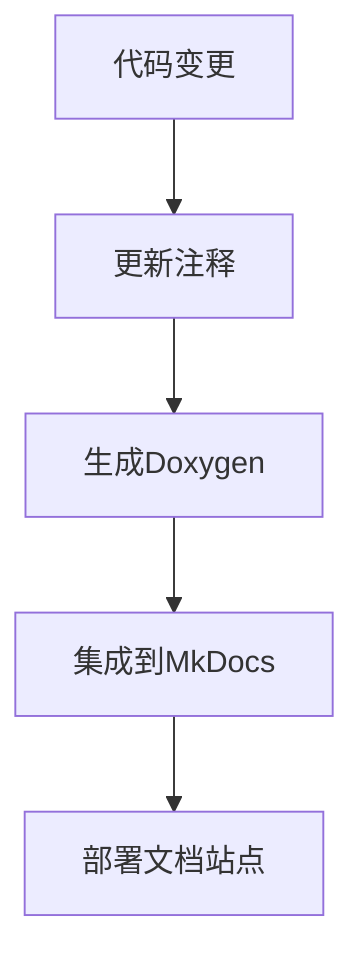

# 贡献指南

## 文档标准
1. 所有函数必须包含Doxygen格式注释
```c
/**
 * @brief 初始化客户端
 * @param ip 服务器IP地址
 * @param port 服务器端口
 * @return 客户端句柄
 */
tsunami_client_t *tsunami_client_init(const char *ip, int port);
```

2. 提交PR时需更新相关文档
3. API变更必须更新reference文档

## 文档构建流程
