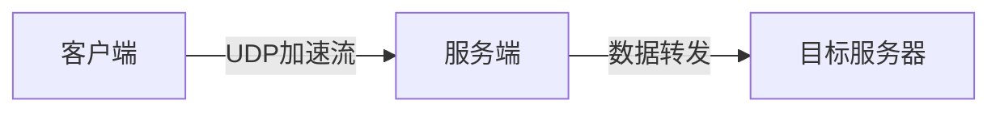

# tsunami-udp 架构设计

## 1. 整体架构

## 2. 核心模块

### 2.1 协议层 (`common/`)
- 实现可靠UDP协议
- 序列号管理
- ACK/NACK处理

### 2.2 传输层 (`client/`, `server/`)
- 滑动窗口实现
- 拥塞控制算法
- 丢包检测与重传

### 2.3 平台适配层 (`win32compat/`)
- Windows套接字适配
- 线程模型抽象
- 异步I/O封装
