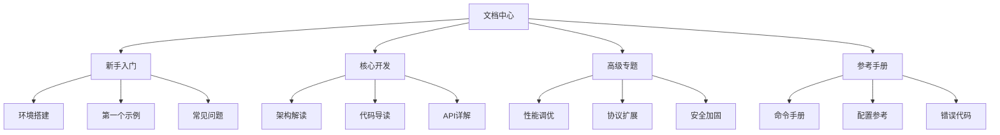

# tsunami-udp 文档中心

## 文档体系概览


## 学习路径
### 新开发者
1. [环境搭建](/tutorials/env_setup.md)
2. [快速入门](/tutorials/quickstart.md)
3. [核心概念](/explanation/core_concepts.md)

### 核心开发者
1. [架构设计](/design/architecture.md)
2. [协议规范](/design/protocol.md)
3. [API参考](/reference/)

## 按场景导航
| 场景 | 文档 |
|------|------|
| 安装部署 | [安装指南](/operations/installation.md) |
| 性能调优 | [性能优化](/advanced/performance.md) |
| 协议扩展 | [协议开发](/advanced/protocol_extension.md) |
| 安全加固 | [安全指南](/advanced/security.md) |

## 文档搜索
```html
<!-- 预留搜索框位置 -->
<div class="search-box">
  <input type="text" placeholder="搜索文档...">
</div>
```