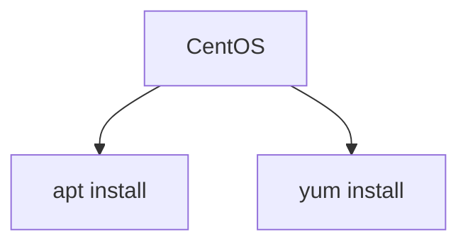

# 多平台环境配置

## Linux 环境

```mermaid
graph TB
    A[Ubuntu] --> B[apt install]
    A[CentOS] --> C[yum install]
```

## Windows 环境
```powershell
# MSYS2 安装
pacman -S autoconf automake libtool
```

## macOS 环境
```bash
# Homebrew 安装
brew install autoconf automake libtool
```