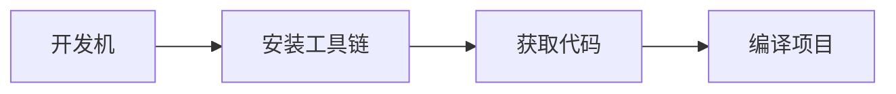

# 新手入门指南

## 环境搭建


## 第一个示例
```bash
# 启动服务端
./rtserver/tsunami_server -p 5000 &

# 传输文件
./rtclient/tsunami_client -s 127.0.0.1 -p 5000 -f test.jpg
```


## 常见问题
| 问题 | 解决方案 |
|------|---------|
| 编译失败 | 检查 autotools 版本 |
| 连接超时 | 检查防火墙设置 |