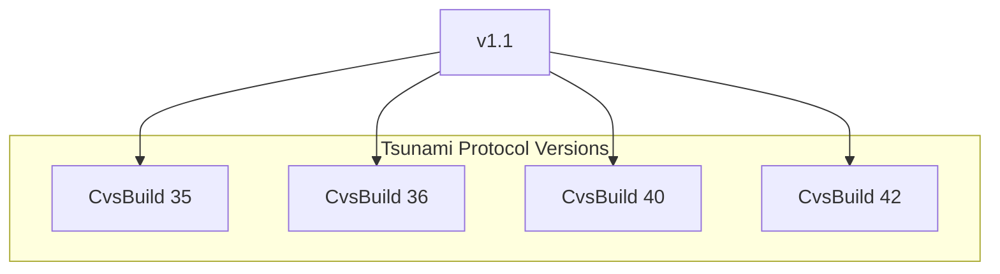

# Other — ChangeLog

# Other — ChangeLog 模块文档

## 功能概述

`ChangeLog` 模块用于记录和管理 Tsunami 协议的版本更新信息。该模块以文本形式提供协议版本、改进内容及新功能说明，帮助开发者了解当前协议状态以及各构建版本（CvsBuild）中的变更细节。

此模块本身不包含可执行代码逻辑，而是作为开发过程中的元数据文件存在，其内容由维护者手动编写并更新。

## 架构与组织方式

### 文件结构

- **位置**：通常位于项目根目录或 `doc/` 目录下。
- **格式**：纯文本格式，便于阅读和版本控制工具处理。
- **命名约定**：
  - 使用如 `ChangeLog`, `changelog.txt` 等标准名称。
  - 内容按协议版本分段，每个版本后跟随多个 CvsBuild 更新条目。

### 版本编号体系

Tsunami 协议采用如下版本号：

```
v1.1
```

其中主版本号为 `1`，次版本号为 `1`。每次重大更改会提升主版本号；而小改则提升次版本号。

### CvsBuild 编号机制

每个 CvsBuild 是一个递增整数，表示从 v1.1 开始的一个具体开发构建版本。例如：

```
v1.1 CvsBuild 42
...
v1.1 CvsBuild 36
...
```

这些编号用于追踪特定修改在哪个构建中被引入，并可用于调试和回溯问题。

## 关键组件描述

### 协议版本声明

```text
The current Tsunami protocol version is: v1.1
```

这是整个日志的起点，标识了当前使用的协议版本。

### 各个 CvsBuild 条目

每一个 CvsBuild 条目都包括以下部分：

#### 标题行
```text
v1.1 CvsBuild 42
```

#### 变更摘要
每一条变更都会详细列出对客户端或服务端所做的改动，比如添加新的配置项、修复某个 bug 或优化性能等。

示例：
```text
  - changes to realtime server code:
   - added EVN 2009 filename aux info parsing so that the
     format with 'ccvvvvv' 2-char code plus value (versus old
     format 'cc=vvvvv') is supported for the data length field
```

#### 涉及模块
- 客户端 (`client`)
- 实时服务器 (`realtime server`)
- 文件服务器 (`file server`)

## 使用方法

### 日常使用场景

开发者应将此 ChangeLog 视为参考文档，在进行代码审查、功能实现或故障排查时查阅相关版本信息。

### 如何维护更新

当有新提交到源码库时，应在该文件末尾追加一个新的 CvsBuild 条目，内容包含：

1. 当前 CvsBuild 的编号；
2. 所做的主要修改（如果涉及多个子系统，请分别说明）；
3. 修改的具体影响范围（如：是否改变了 API 接口、行为逻辑等）；
4. 如果是测试版，则注明 `(testing version!)`。

### 示例格式

```text
v1.1 CvsBuild 43
  - changes to client code:
    - fixed a memory leak in block processing loop
  - changes to server code:
    - improved logging of TCP connection errors
```

## Mermaid 图表说明

由于本模块仅提供文本形式的日志记录，无实际执行流程或内部调用关系，因此无需展示 Mermaid 架构图来解释其结构。但为了清晰表达不同版本之间的依赖关系，可以考虑如下简单图表示意：



该图表示当前协议版本 `v1.1` 下的各个构建版本及其可能存在的关联性。但由于没有明确的函数/类间调用链路，这种可视化并不具备技术指导意义。