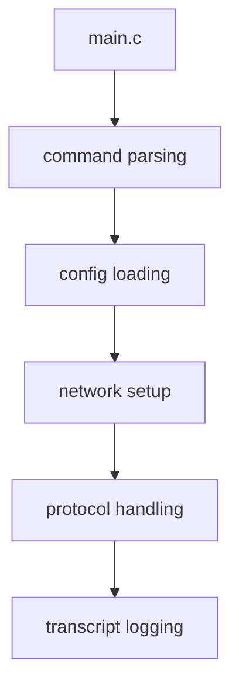

# Other — client

# Other — client 模块文档

## 功能概述

`client` 模块是 `tsunami` 软件包的客户端程序入口，负责处理用户命令行输入、配置加载、网络通信和数据传输等核心功能。该模块提供了一个完整的命令行界面来与系统交互，并管理整个客户端生命周期。

## 架构设计

### 主要组件

该模块由多个源文件组成，每个文件承担特定职责：

- **command.c**：命令解析和执行逻辑
- **config.c**：配置文件读取和参数处理  
- **io.c**：输入输出操作封装
- **main.c**：主程序入口点和流程控制
- **network.c**：网络连接建立和维护
- **protocol.c**：协议层实现
- **ring.c**：环形缓冲区相关操作
- **transcript.c**：会话记录和日志处理

### 编译结构

```makefile
AM_CPPFLAGS             = -I$(top_srcdir)/include
common_lib              = $(top_builddir)/common/libtsunami_common.a
bin_PROGRAMS              = tsunami
tsunami_SOURCES         = command.c config.c io.c main.c network.c protocol.c ring.c transcript.c
tsunami_LDADD           = $(common_lib) -lpthread
tsunami_DEPENDENCIES  = $(common_lib)
```

编译时依赖于 `common` 子模块提供的基础库函数，链接线程库以支持并发操作。

## 使用方法

### 编译方式

该模块提供了两种编译方式：
1. 使用 Autotools 的标准构建（Makefile.am）
2. 独立 Makefile 方式（Makefile_standalone）

独立编译模式下使用如下命令：
```bash
gcc -Wall -O3 -I../common/ -I../include/ -pthread -D_FILE_OFFSET_BITS=64 -D_LARGEFILE_SOURCE \
    command.c config.c io.c main.c network.c network_v4.c network_v6.c protocol.c ring.c transcript.c \
    ../common/common.c ../common/error.c ../common/md5.c -o tsunami
```

### 运行示例

程序运行后将启动命令行交互界面，用户可以输入各种命令进行操作。具体行为取决于命令处理器的实现。

## 执行流程

由于没有检测到明确的执行流，主要流程为：



## 与其他模块的关系

此模块通过以下方式与代码库其他部分集成：

- 链接 `common` 模块获取通用功能如错误处理、MD5计算等
- 作为客户端应用直接调用网络通信接口
- 实现协议层来与服务器端组件交互
- 提供会话记录机制用于调试和审计

该模块是整个系统中面向用户的前端接口，负责协调各个子系统的协同工作。