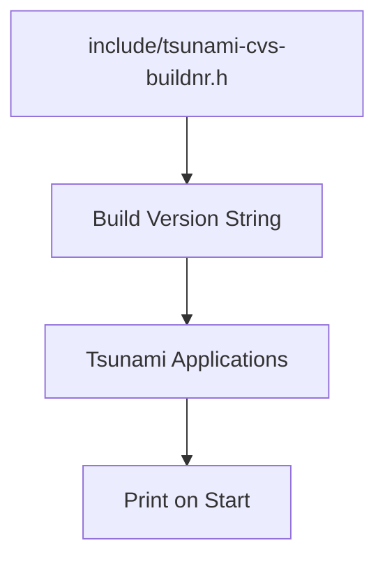

# Other — include

# Other — include 模块文档

## 功能概述

`include` 模块是 Tsurami 软件项目中的一个头文件集合管理模块。它主要负责提供全局定义的 CVS 提交版本号（`TSUNAMI_CVS_BUILDNR`），该版本号在程序启动时会被打印出来，用于标识当前使用的 CVS 构建版本。

此模块不包含任何可执行代码逻辑，仅作为配置和版本信息的集中管理点存在。

## 架构说明

### 文件结构

```
include/
├── md5.h
├── tsunami.h
├── tsunami-client.h
├── tsunami-cvs-buildnr.h
└── tsunami-server.h
```

所有这些头文件都通过 `Makefile.am` 中的 `noinst_HEADERS` 变量被编译系统识别并安装到构建目录中。其中：

- **tsunami-cvs-buildnr.h** 是核心组件，定义了 `TSUNAMI_CVS_BUILDNR` 宏。
- 其他头文件为项目的其他部分提供接口声明。

### 版本控制机制

`tsunami-cvs-buildnr.h` 中的宏定义格式如下：
```c
#define TSUNAMI_CVS_BUILDNR "v1.1 devel cvsbuild 43"
```

这个字符串包含了以下信息：
- `v1.1`: 当前主版本号
- `devel`: 开发状态标记（devel 或 final）
- `cvsbuild`: 固定标识符，表示这是基于 CVS 的构建版本
- `43`: 增长编号，每次提交前需手动更新以递增

该版本号会在应用程序启动时输出，便于追踪不同机器上的构建一致性。

## 使用方法

### 在源码中引用

开发者可以在任意 C/C++ 源文件中使用如下方式获取当前构建版本：

```c
#include <tsunami-cvs-buildnr.h>

// 获取构建版本号
const char* build_version = TSUNAMI_CVS_BUILDNR;
```

### 手动维护版本号

每当向 CVS 提交更改之前，必须手动编辑 `tsunami-cvs-buildnr.h` 文件来更新增长编号部分。例如将 `"v1.1 devel cvsbuild 43"` 更新为 `"v1.1 devel cvsbuild 44"`。

> ⚠️ 注意：由于这是一个手动过程，容易出错，请确保每次提交后正确更新版本号。

## 连接与依赖关系

该模块是整个软件包的基础配置模块之一，其内容被多个子模块所共享。虽然没有直接调用链或执行流程图，但它的作用体现在以下几个方面：

- 被 `tsunami.h`, `tsunami-client.h`, 和 `tsunami-server.h` 等头文件间接包含；
- 在程序初始化阶段会被读取和打印，用于调试和部署环境确认；
- 不参与实际运行逻辑，仅作为静态资源存在。

## Mermaid 图表说明



此图表展示了 `tsunami-cvs-buildnr.h` 如何作为一个版本信息源传递给 Tsurami 应用程序，并在启动时显示出来。