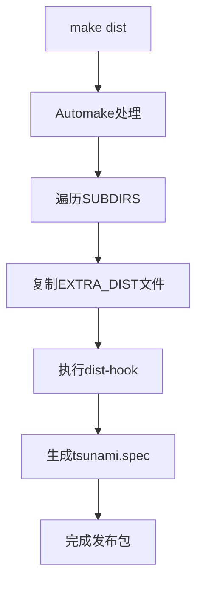

# Other — Makefile.am

# Makefile.am 模块文档

## 功能概述

此模块是Tsunami软件包的Automake配置文件，用于定义项目的构建规则和分发文件。它控制着整个项目结构的编译过程，并为RPM打包提供必要的支持。

## 架构设计

### 核心组件

```
Makefile.am
├── SUBDIRS - 定义子目录列表
├── EXTRA_DIST - 额外分发文件
└── dist-hook - 分发钩子目标
```

### 关键配置项

- **SUBDIRS**: 包含所有需要编译的子目录，当前包括 `include`、`common`、`client`、`server`、`util`、`rtserver` 和 `rtclient`
- **EXTRA_DIST**: 列出除了源代码之外还需要包含在发布包中的额外文件
- **dist-hook**: 自定义分发目标，用于生成RPM打包所需的spec文件

## 使用方法

### 基本使用流程

```bash
# 运行configure脚本（通常由autoreconf生成）
./configure

# 编译项目
make

# 创建发布包
make dist
```

### 发布包创建机制

当执行 `make dist` 时：
1. Automake会自动处理SUBDIRS中列出的所有子目录
2. 将EXTRA_DIST中指定的文件复制到发布目录
3. 执行dist-hook目标，将tsunami.spec文件复制到发布目录

### 贡献者指南

#### 修改子目录结构
如果要添加或移除子目录，请修改SUBDIRS变量：

```makefile
SUBDIRS = include common client server util rtserver rtclient
```

#### 添加新文件到发布包
如需将新文件包含在发布包中，请将其添加到EXTRA_DIST变量中：

```makefile
EXTRA_DIST = \
    LICENSE.txt \
    README.txt \
    depcomp \
    tsunami.spec.in \
    new_file.txt
```

## 注意事项

### 特殊说明

- `depcomp` 文件必须显式列在 EXTRA_DIST 中，即使它是automake自动生成的文件
- 当前注释掉的 `SUBDIRS` 行显示了可能的替代配置选项
- dist-hook 目标是为了满足 RPM 打包需求而存在的特殊hack

## 依赖关系

该模块不直接调用其他函数或类，而是作为构建系统的一部分被automake工具链使用。其主要作用是协调项目的构建和分发流程。

## 示例执行流



此模块通过标准的automake接口与整个项目集成，在构建过程中起到协调各组件的作用。