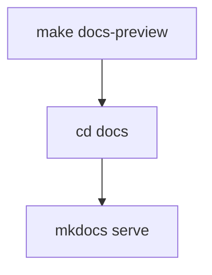

# Other — Makefile

# Other — Makefile

## 功能概述

这是一个简单的Makefile模块，主要用于开发环境中的文档预览功能。它提供了一个便捷的命令来启动MkDocs服务器，使开发者能够实时查看文档内容。

## 架构说明

该模块采用极简设计模式，只包含一个目标规则：

```makefile
docs-preview:
	cd docs && mkdocs serve
```

### 核心组件

- **docs-preview**: 主要的目标规则，用于启动文档预览服务

## 使用方法

### 基本用法

在项目根目录下执行：
```bash
make docs-preview
```

这将：
1. 切换到`docs`目录
2. 启动MkDocs服务器

### 执行流程



### 依赖要求

需要安装以下工具：
- make（系统工具）
- MkDocs（Python文档生成器）

## 注意事项

- 此模块不包含任何内部调用或外部依赖
- 执行时会切换工作目录，确保当前路径正确
- 仅适用于支持make命令的Unix-like系统环境

## 相关性

此模块与代码库中其他部分无直接连接关系，主要服务于文档构建和预览场景。