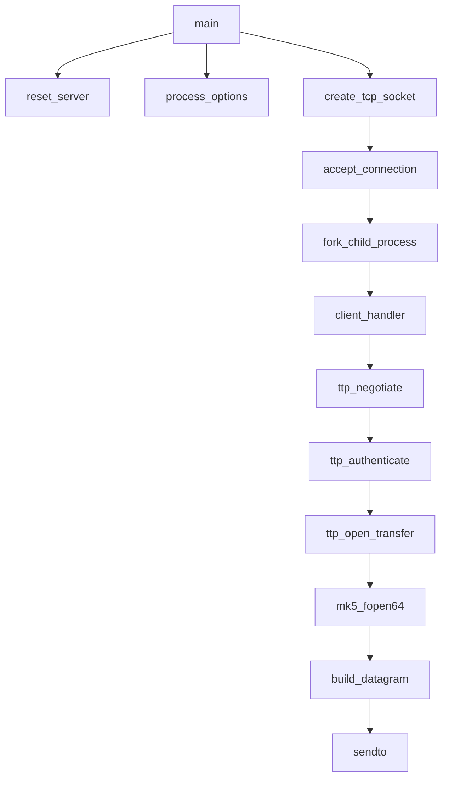
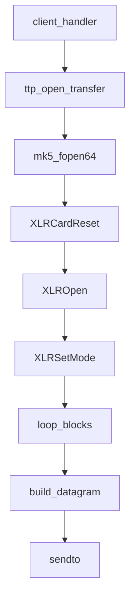

# Other — mk5server

# mk5server 模块文档

## 模块概述

`mk5server` 是一个基于 Tsunami 协议的 Mark5 数据传输服务器实现。它通过 TCP 和 UDP 网络协议，为客户端提供从 StreamStor 存储设备读取数据的服务。

该模块主要面向开发人员和系统管理员，用于构建支持 Mark5 设备的数据传输服务端程序。

## 核心功能与架构

### 功能描述

- 启动 TCP 服务器监听客户端连接请求
- 处理客户端认证、文件请求及重传请求
- 使用 StreamStor API 实现对物理存储设备的访问
- 支持 IPv4 和 IPv6 双栈网络通信
- 提供统计记录（transcript）功能以分析传输性能

### 主要组件结构

```
mk5server/
├── main.c          # 主程序入口，处理 socket 创建和主循环
├── config.c          # 配置参数管理
├── io.c            # 文件 I/O 操作封装
├── network.c         # 网络 socket 初始化配置
├── protocol.c        # TTP 协议处理逻辑
├── transcript.c      # 统计日志生成
├── mk5api.c        # StreamStor API 封装
└── mk5api.h        # StreamStor API 声明头文件
```

### 关键类与结构体定义

#### `MK5FILE` 结构体

```c
typedef struct MK5FILE_tt {
   SSHANDLE    sshandle;   // StreamStor 设备句柄
   S_READDESC  rdesc;      // 读操作描述符：缓冲区地址、磁盘地址、数据长度等信息
} MK5FILE;
```

此结构体封装了 StreamStor 的文件操作接口，用于在底层存储设备上进行数据读写。

#### `ttp_session_t` 结构体

```c
typedef struct ttp_session_t {
    int client_fd;              /* 客户端套接字 */
    ttp_parameter_t *parameter; /* 当前会话使用的参数 */
    ttp_transfer_t transfer;     /* 当前传输对象 */
    u_int32_t session_id;       /* 会话 ID */
} ttp_session_t;
```

表示一次客户端连接的会话状态，包含客户端套接字、参数设置以及当前传输任务的信息。

#### `retransmission_t` 结构体

```c
typedef struct retransmission_t {
    u_int32_t block;           /* 请求块号 */
    u_int16_t request_type;    /* 请求类型 */
    u_int32_t error_rate;    /* 错误率 */
} retransmission_t;
```

用于接收来自客户端的重传请求消息，包括请求类型、块编号和错误率等字段。

## 核心流程说明

### 启动流程



主程序启动后初始化配置并创建 TCP socket 监听客户端连接。每当有新连接建立时，fork 子进程处理该连接，并进入 client_handler 流程。

### 文件访问流程



当客户端发起文件请求时，服务器通过 mk5_fopen64 打开指定文件，然后逐块构建数据包并通过 UDP 发送出去。

### 协议交互流程

协议交互主要分为以下几个阶段：

1. **版本协商**：在认证之前进行协议版本一致性检查。
2. **身份验证**：
   - 服务端生成随机数发送给客户端；
   - 客户端使用共享密钥加密后返回 MD5 值；
   - 服务端比对结果确认是否合法。
3. **文件传输控制**：
   - 客户端请求特定文件名；
   - 服务端打开文件并返回元信息（大小、块数量等）；
   - 服务端根据目标速率计算 IPD 并开始传输；

## API 接口说明

### StreamStor 封装接口

#### `mk5_fopen64`
```c
MK5FILE* mk5_fopen64(const char *path, const char *mode);
```
- 功能：打开一个 StreamStor 设备上的文件
- 参数：路径字符串、模式（只支持 "r"）
- 返回值：成功返回 MK5FILE 指针，失败返回 NULL

#### `mk5_fclose`
```c
int mk5_fclose(MK5FILE *fp);
```
- 功能：关闭已打开的文件句柄
- 参数：文件指针
- 返回值：0 表示成功，非零表示错误

#### `mk5_fseek`
```c
int mk5_fseek(MK5FILE *stream, off_t offset, int whence);
```
- 功能：设置文件读取位置
- 参数：文件指针、偏移量、起始点（SEEK_SET）
- 返回值：0 表示成功，非零表示错误

#### `mk5_ftello`
```c
off_t mk5_ftello(MK5FILE *fp);
```
- �功能：获取当前文件读取位置
- 注意：目前未实现

#### `mk5_fread`
```c
size_t mk5_fread(void *ptr, size_t size, size_t nmemb, MK5FILE *stream);
```
- 功能：从文件中读取数据到缓冲区
- 参数：目标地址、单个元素大小、元素个数、文件指针
- 返回值：实际读取字节数

### 网络相关函数

#### `create_tcp_socket`
```c
int create_tcp_socket(ttp_parameter_t *parameter);
```
- 功能：创建 TCP socket 监听连接
- 参数：参数结构体指针
- 返回值：socket 文件描述符或负值表示出错

#### `create_udp_socket`
```c
int create_udp_socket(ttp_parameter_t *parameter);
```
- 功能：创建 UDP socket 用于数据传输
- 参数：参数结构体指针
- 返回值：socket 文件描述符或负值表示出错

## 配置选项与使用方法

### 编译要求

由于依赖于 StreamStor �库 `libssapi.a`，需要使用 g++ 进行编译。在 configure 吇后需手动修改 Makefile 中的 CC 变量为 g++。

### 命令行参数

| 参数 | 描述 |
|------|-------|
| --verbose 或 -v | 开启详细输出模式 |
| --transcript | 开启统计记录模式 |
| --v6 | 使用 IPv6 而不是 IPv4 |
| --port=n | 指定监听端口 |
| --secret=s | 设置共享密钥 |
| --datagram=bytes | 设置 datagram 大小 |
| --buffer=bytes | 设置 UDP 发送缓冲区大小 |

### 示例启动命令

```bash
./mk5tsunamid --port=8080 --secret=kitten --datagram=32768 --buffer=20000000
```

该命令将服务器运行在 8080 端口上，并设置默认共享密钥为 "kitten"，datagram 大小为 32KB，UDP 缓冲区为 20MB。

## 日志系统说明

日志模块提供以下功能：

1. **日志写入**：
   ```c
   void log(FILE *log_file, const char *format, ...);
   ```
   - 格式化并写入时间戳和客户端 PID 的日志条目

2. **统计记录**（Transcript）**：
   - 在每次传输开始时生成一个 transcript 文件；
   - 记录传输过程中的关键信息如块数量、目标速率等；
   - 结束时记录吞吐量、持续时间和总传输字节数；

## 注意事项

1. 当前仅支持 SEEK_SET 方式的文件定位。
2. mk5_fopen64 函数目前只支持单个 StreamStor 卡片访问。
3. 所有网络通信均基于 TCP 和 UDP 实现。
4. 支持多文件获取（GET *），但需要配合特定客户端实现。

## 代码贡献指南

本模块主要由以下几个部分组成：

- `main.c`: 主程序逻辑入口点
- `config.c`: 默认配置初始化及重置函数
- `io.c`: 数据包构建函数
- `network.c`: socket 初始化与绑定函数
- `protocol.c`: TTP 协议处理函数
- `transcript.c`: 统计日志相关函数
- `mk5api.c`/`mk5api.h`: StreamStor API 封装层

开发人员应遵循以下原则进行修改：

1. 遵守现有命名规范和结构体定义；
2. 修改协议交互逻辑需确保兼容性；
3. 增加新功能时注意对错误处理的封装；
4. 对于涉及底层存储设备的操作，务必检查返回值并正确释放资源。