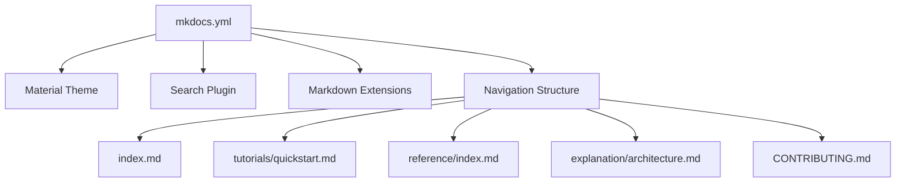

# Other — mkdocs.yml

# Other — mkdocs.yml

## 功能概述

`mkdocs.yml` 是用于配置 [MkDocs](https://www.mkdocs.org/) 文档生成工具的主配置文件。它定义了站点的基本设置、主题样式、插件启用以及导航结构等信息，是整个文档系统的入口点。该文件决定了如何构建和呈现项目文档，并与 `CONTRIBUTING.md` 和其他 Markdown 文件协同工作以提供完整的开发文档支持。

## 核心组件说明

### site_name（站点名称）

```yaml
site_name: tsunami-udp
```

指定文档网站的标题为 `tsunami-udp`，在页面头部及浏览器标签中显示。

### repo_url（仓库地址）

```yaml
repo_url: https://github.com/your-repo/tsunami-udp
```

指向项目的源代码仓库地址，通常会出现在文档页脚或顶部链接中，方便开发者访问原始代码库。

### theme（主题）

```yaml
theme:
  name: material
  features:
    - navigation.tabs
```

使用 Material 主题作为文档外观风格，并启用了 `navigation.tabs` 特性来增强导航栏体验。

### plugins（插件）

```yaml
plugins:
  - search
  - markdownextradata
```

- **search**：启用内置搜索功能。
- **markdownextradata**：允许从外部 YAML 数据注入到 Markdown 中，便于动态内容管理。

### markdown_extensions（Markdown 扩展）

```yaml
markdown_extensions:
  - admonition
  - toc:
      permalink: true
  - pymdownx.superfences
```

对 Markdown 渲染进行扩展：
- **admonition**：支持如警告、提示等块级注释语法。
- **toc**：自动生成目录并添加永久链接锚点。
- **pymdownx.superfences**：增强代码块和表格渲染能力。

### extra（额外数据）

```yaml
extra:
  version: 1.0.0
```

定义附加变量，在模板中可通过 `{{ config.extra.version }}` 访问当前版本号。

### nav（导航菜单）

```yaml
nav:
  - 首页: index.md
  - 教程:
    - 快速开始: tutorials/quickstart.md
  - API参考: reference/index.md
  - 概念解析:
    - 架构设计: explanation/architecture.md
  - 开发指南:
    - 贡献规范: CONTRIBUTING.md
```

用于组织文档结构的导航列表，每个条目对应一个 Markdown 页面路径。此配置控制左侧侧边栏的内容顺序和层级关系。

## 架构连接图



该文件通过其配置项与 MkDocs 的各个模块交互，最终将这些设置应用于实际生成的静态网站页面上。它不直接调用任何函数或类，而是作为一个声明式入口点影响整个文档系统的构建流程。

## 使用方法

要修改文档行为，请编辑本文件中的相关字段：

1. 修改站点名称时更新 `site_name`
2. 更改仓库链接时更新 `repo_url`
3. 添加新插件时在 `plugins:` 下增加一行
4. 增强 Markdown 支持时调整 `markdown_extensions`
5. 更新额外信息时修改 `extra`
6. 管理文档结构时调整 `nav` 内容

所有更改需符合 YAML 格式要求，并确保所引用的 Markdown 文件存在且路径正确。运行 `mkdocs serve` 或 `mkdocs build` 可使改动生效。