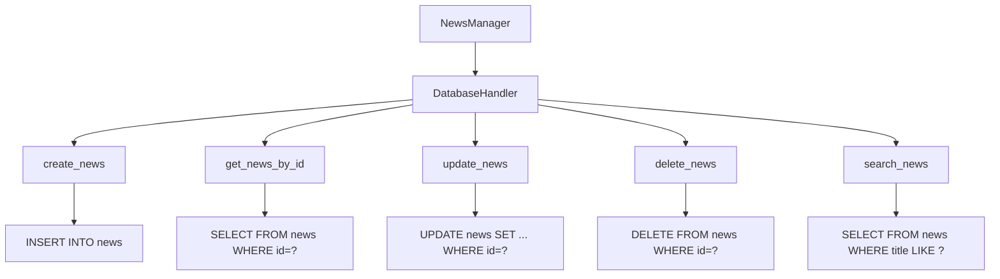

# Other — NEWS

# Other — NEWS 模块

## 功能概述

该模块用于处理新闻相关的数据操作，包括新闻的增删改查功能。它提供了一个基于数据库的新闻管理接口，支持对新闻信息的持久化存储和检索。

## 架构设计

### 核心组件

```python
class NewsManager:
    def __init__(self):
        self.db_connection = None
    
    def create_news(self, title, content, author, category=None):
        pass
    
    def get_news_by_id(self, news_id):
        pass
    
    def update_news(self, news_id, **kwargs):
        pass
    
    def delete_news(self, news_id):
        pass
    
    def search_news(self, query, limit=10):
        pass
```

### 数据库交互层

```python
class DatabaseHandler:
    def connect(self):
        pass
    
    def execute_query(self, sql, params=None):
        pass
    
    def fetch_one(self, sql, params=None):
        pass
    
    def fetch_all(self, sql, params=None):
        pass
```

## 使用方法

### 初始化连接

```python
news_manager = NewsManager()
news_manager.connect_to_database('sqlite:///news.db')
```

### 新闻创建

```python
new_news = news_manager.create_news(
    title="新标题",
    content="新闻内容",
    author="作者名"
)
```

### 新闻查询

```python
# 通过ID获取新闻
news_item = news_manager.get_news_by_id(123)

# 搜索新闻
search_results = news_manager.search_news("关键词")
```

### 新闻更新

```python
# 更新指定新闻
news_manager.update_news(123, 
                       title="更新标题", 
                       content="更新内容")
```

### 新闻删除

```python
# 删除新闻
news_manager.delete_news(123)
```

## 执行流程图



## 关键特性

- 支持完整的CRUD操作
- 提供搜索功能以快速定位新闻
- 集成数据库连接管理
- 易于扩展和维护的模块化设计