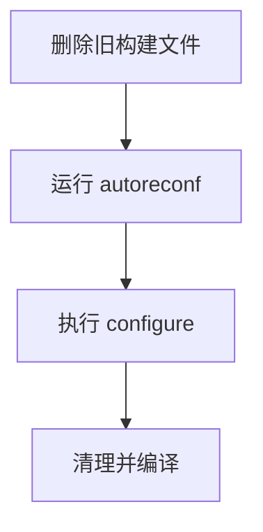

# Other — recompile.sh

# recompile.sh 模块文档

## 功能概述

`recompile.sh` 是一个用于重新编译项目的 Shell 脚本。它通过清理旧的构建文件并运行 Autotools 工具链来初始化项目配置环境，并最终执行 `make` 命令完成编译过程。该脚本主要用于在源码更新后或开发环境中重置构建状态以确保干净编译。

## 架构与流程

此脚本采用线性执行结构，不包含内部函数调用或复杂的控制流。其主要工作流程如下：



### 核心操作步骤

1. **清理构建缓存和中间文件**：
   - 删除 `configure`、`Makefile` 和 `Makefile.in`
   - 清理子目录中的 `Makefile` 及其模板文件
   - 移除 `.deps` 目录（依赖信息）
   - 清空 `autom4te.cache` 缓存目录

2. **生成新的配置文件**：
   - 执行 `autoreconf -i -f -s` 来重建配置支持文件。
     > 注意：其他如 `aclocal`, `autoheader`, `automake`, `autoconf` 等命令被注释掉，未启用。

3. **运行配置脚本**：
   - 执行自动生成的 `./configure` 脚本来设置编译参数及检测系统特性。

4. **编译项目**：
   - 使用 `make clean` 清理之前的编译产物；
   - 用 `make -j8` 并行编译项目（使用 8 个并发进程）；

5. **提示安装命令**：
   - 输出一条建议用户运行 `sudo make install` 的消息，以便将可执行文件安装到 `/usr/bin` 中。

## 使用方法

### 基本用法

直接运行脚本即可触发完整的重新编译流程：

```bash
sh recompile.sh
```

### 高级选项说明

- 如果需要为特定平台定制编译器和链接库，请取消注释并修改 `./configure` 行中提供的额外标志。
- 示例（适用于 Solaris）：
  ```bash
  ./configure CC=gcc CPPFLAGS=-Du_int64_t=uint64_t -Du_int32_t=uint32_t -Du_int16_t=uint16_t -Du_int8_t=uint8_t LIBS=-lsocket -lnsl -lrt 
  ```

> ⚠️ 注：当前版本默认使用标准配置行为，仅在必要时才手动指定参数。

## 连接与集成

该脚本作为开发环境的一部分，通常由开发者在本地环境中调用。它不依赖于任何外部模块或函数，也不对外部模块发起调用。整个过程完全独立完成，并且没有与其他代码模块形成直接连接关系。

## 注意事项

- 此脚本假设项目根目录下存在有效的 Autotools 构建系统（例如 configure.ac 或 Makefile.am 文件）。
- 在某些平台上可能需要先安装 `autoconf`, `automake`, `libtool` 等工具才能成功运行 `autoreconf`。
- 若目标是跨平台构建，应根据操作系统调整 `configure` 参数以兼容不同系统的头文件定义差异。