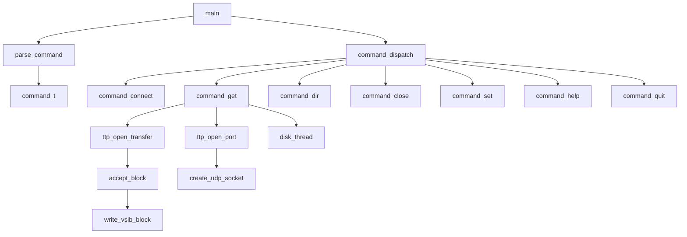

# Other — rtclient

# Other — rtclient 模块文档

## 功能概述

`rtclient` 是 Tsunami 实时文件传输协议（Tsunami Transfer Protocol, TTP）的命令行客户端实现。它支持通过 TCP 控制通道与服务器建立连接，并使用 UDP 数据通道进行高速数据传输，适用于需要低延迟、高吞吐量的数据传输场景，如 eVLBI 等实时应用。

该模块主要提供以下功能：
- 命令解析和执行：包括 `connect`, `get`, `dir`, `close`, `set`, `help`, `quit` 等命令。
- 文件传输控制逻辑：处理文件请求、重传机制、统计信息收集等。
- 网络通信管理：TCP 和 UDP socket 的创建、配置和管理。
- 数据写入磁盘线程：将接收到的数据块异步写入本地文件系统或 VSIB 设备。
- 参数设置和默认值管理：用于配置传输行为的各种参数。

## 架构说明

### 主要组件结构图



### 核心类与函数

#### 类型定义

| 类型 | 描述 |
|------|------|
| `command_t` | 存储用户输入命令的文本及分词结果 |
| `ttp_session_t` | 表示一个 Tsunami 客户端会话 |
| `ttp_parameter_t` | 包含所有可调参数的结构体 |
| `ttp_transfer_t` | 代表一次具体的文件传输任务 |

#### 关键函数

##### 命令处理相关

| 函数名 | 来源 | 功能描述 |
|--------|------|----------|
| `command_connect()` | command.c | 连接到远程 Tsunami 服务器并完成认证 |
| `command_get()` | command.c | 请求获取远程文件，包含完整的数据接收和写入流程 |
| `command_dir()` | command.c | 获取远程服务器共享文件列表 |
| `command_close()` | command.c | 关闭当前连接 |
| `command_set()` | command.c | 设置客户端参数 |
| `command_help()` | command.c | 显示帮助信息 |
| `command_quit()` | command.c | 退出客户端程序 |

##### 网络操作相关

| 函数名 | 来源 | 功能描述 |
|--------|------|----------|
| `create_tcp_socket()` | network.c | 创建 TCP 控制通道 socket |
| `create_udp_socket()` | network.c | 创建 UDP 数据通道 socket |
| `ttp_negotiate()` | protocol.c | 协商协议版本 |
| `ttp_authenticate()` | protocol.c | 使用共享密钥进行身份验证 |

##### 数据块处理相关

| 函数名 | 来源 | 功能描述 |
|--------|------|----------|
| `disk_thread()` | command.c | 负责将接收到的数据块从 ring buffer 写入磁盘或 VSIB 设备 |
| `accept_block()` | io.c | 实际执行数据块到本地文件的写入操作 |
| `got_block()` | command.c | 检查某个 block 是否已经被接收过 |
| `ring_create()`, `ring_reserve()`, `ring_confirm()`, `ring_pop()` | ring.c | 提供环形缓冲区管理功能 |

## 使用方法

### 启动方式

```bash
./rttsunami [options...]
```

支持通过命令行参数直接指定命令（如 `-c localhost -p 12345 get testfile.txt`），也可以交互式运行。

### 支持的命令

- **connect**：建立与服务器的连接。
    ```bash
    connect <host> <port>
    ```

- **get**：请求获取远程文件。
    ```bash
    get <remote_file> [<local_file>]
    ```
    如果未提供本地文件名，则自动提取远程文件名作为本地名称。

- **dir**：列出服务器上所有可传输的文件。
    ```bash
    dir
    ```

- **close**：关闭当前连接。
    ```bash
    close
    ```

- **set**：设置各种参数。
    ```bash
    set server <hostname>
    set port <port_number>
    set blocksize <bytes>
    set rate <bps>
    set lossless yes/no
    set transcript yes/no
    ...
    ```

- **help**：显示帮助信息。
    ```bash
    help
    help <command>
    ```

- **quit/exit/bye**：退出客户端程序。
    ```bash
    quit
    ```

## 参数说明

| 参数 | 默认值 | 描述 |
|------|-------|------|
| `server_name` | `"localhost"` | 远程服务器主机名 |
| `server_port` | `TS_TCP_PORT` (通常为 10001) | TCP 控制端口 |
| `client_port` | `TS_UDP_PORT` (通常为 10002) | UDP 数据端口 |
| `block_size` | `1024` 字节 | 单个数据块大小 |
| `target_rate` | `650,000,000 bps` | 目标带宽速率 |
| `error_rate` | `7500` (即 0.75%) | 允许的最大错误率阈值 |
| `lossless` | `yes` | 是否启用无损传输模式 |
| `transcript_yn` | `no` | 是否记录传输日志 |
| `ipv6_yn` | `no` | 是否使用 IPv6 地址解析 |
| `output_mode` | `LINE_MODE` | 输出格式控制，例如屏幕或行模式 |

## 实现细节

### 文件传输流程

```text
[用户输入 GET 命令] 
       ↓
[调用 command_get()] 
       ↓
[创建 transfer 对象并初始化] 
       ↓
[发送 open_transfer 请求到服务器] 
       ↓
[服务器返回文件元数据（file size, block count）] 
       ↓
[分配 ring buffer 和 local_datagram 缓冲区] 
       ↓
[启动 disk_thread 线程用于异步写入磁盘]
       ↓
[循环接收 UDP 数据包]
       ↓
[判断是否重复 block 或需要重传]
       ↓
[将新 block 写入 ring_buffer 并确认]
       ↓
[等待 disk_thread 处理完所有 block]
       ↓
[关闭 socket 和文件句柄]
```

### 重传机制

在 `command_get()` 中实现了基于环形缓冲区的重传请求逻辑。当检测到丢包时会触发：

1. 检查当前已收到的数据块；
2. 构造 retransmit 请求列表；
3. 调用 `ttp_repeat_retransmit()` 发送请求给服务器。

如果请求过多导致表溢出，则会尝试重新开始传输，并设置 `restart_pending` 标记以避免处理旧数据。

### VSIB 支持

编译选项 `-DVSIB_REALTIME` 启用对 VSIB 设备的支持，在实时 eVLBI 应用中可直接输出数据至硬件设备。支持以下功能：
- 使用 `/dev/vsib` 设备进行数据输出；
- 在 `accept_block()` 函数中调用 `write_vsib_block()` 将数据写入 VSIB；
- 配置参数包括 `vsib_mode`, `vsib_gigabit`, `embed_1pps_marker`, `skip_samples` 等；

### 日志与调试

模块内包含多个调试宏开关，如 `DEBUG_RETX` 可开启重传调试信息打印，`RETX_REQBLOCK_SORTING` 控制排序方式等。

## 与其他模块的关系

- **include/tsunami-client.h**：定义了客户端核心结构体和 API。
- **common/libtsunami_common.a**：提供通用工具函数、错误处理、时间转换等功能。
- **rtclient/vsibctl.c / vsibctl.h**：VSIB 相关控制接口，用于实时数据流输出。
- **rtclient/ring.c**：环形缓冲区实现，被 `disk_thread` 所依赖。
- **rtclient/transcript.c**：日志记录相关代码，由 `command_set()` 和 `command_get()` 调用。

## 注意事项

- 客户端默认使用 IPv4 地址解析，可通过 `set ip v6` 切换为 IPv6。
- 当前版本不支持多线程并发访问同一 socket（UDP socket 不允许复用）。
- 若未指定本地文件名，默认从远程路径提取最后部分作为本地名称。
- 数据接收过程中若出现异常，程序将终止并提示用户重新连接。
- 编译时需确保有 pthread 库支持。