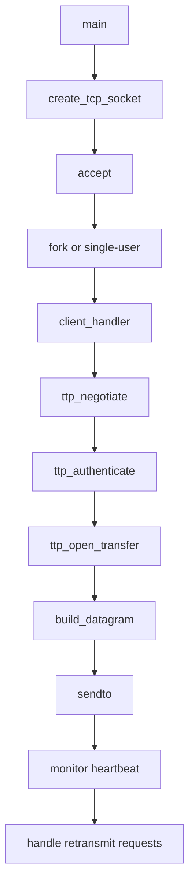

# Other — rtserver

# rtserver 模块文档

## 功能概述

rtserver 是 Tsunami 实时文件传输服务器的实现，用于通过网络协议提供实时数据流服务。该模块支持 VSIB（VLBI 数据采集板）访问模式，并可作为普通 TCP 文件服务器运行。

## 架构说明

### 标准服务器流程图


### 主要组件结构

- **主程序入口**: `main.c` - 启动并管理服务器进程
- **配置处理**: `config.c` - 提供默认参数和重置功能
- **I/O操作**: `io.c` - 处理VSIB设备读取与本地磁盘写入
- **日志记录**: `log.c` - 日志格式化输出
- **网络通信**: `network.c` - 创建TCP和UDP套接字
- **协议交互**: `protocol.c` - 客户端认证、文件请求处理等核心协议逻辑
- **事务记录**: `transcript.c` - 转录文件生成及统计信息记录
- **EVN文件名解析**: `parse_evn_filename.c` 和 `parse_evn_filename.h` - 解析 EVN �命名规范中的时间戳和其他元数据字段

## 使用方法

### 编译安装
使用标准 autotools 流程编译：
```bash
./configure --enable-vsib-realtime
make
```
需要启用 `--enable-vsib-realtime` 配置选项以激活 VSIB 支持。

### 运行方式
```bash
rttsunamid [options] [filename1 filename2 ...]
```

#### 可选命令行参数:
| 参数 | 描述 |
|------|------|
| `--verbose`, `-v` | 开启详细输出模式 |
| `--transcript`, `-t` | 开启转录模式进行统计数据记录 |
| `--v6`, `-6` | 使用 IPv6 协议栈 |
| `--port=N`, `-p N` | 指定监听的 TCP 端口号 |
| `--secret=SECRET`, `-s SECRET` | 设置共享密钥用于客户端认证 |
| `--buffer=BYTES`, `-b BYTES` | UDP 发送缓冲区大小（字节） |
| `--hbtimeout=SECONDS`, `-h SECONDS` | 心跳超时秒数，超过则断开连接 |
| `--vsibmode=M`, `-M M` | VSIB 模式设置 (仅在启用实时支持时可用) |
| `--vsibskip=N`, `-S N` | 数据跳过采样策略 (仅在启用实时支持时可用) |

示例启动:
```bash
# 启动普通 TCP 文件服务器
rttsunamid --port=8000 --secret="mysecret"

# 启动 VSIB 实时服务器
rttsunamid --port=8000 --secret="mysecret" --vsibmode=3 --vsibskip=4
```

### 与代码库其他部分的关系

此模块依赖于以下公共组件:

- `include/tsunami-server.h`: 包含所有通用类型定义、宏和函数声明。
- `common/libtsunami_common.a`: 提供基础工具如随机数生成器、网络辅助等。
- `vsibctl.c`: 实现了对 `/dev/vsib` 的访问控制逻辑。

## 核心功能详解

### 主程序流程 (`main`)
主程序负责初始化、创建TCP套接字并等待客户端连接。根据是否启用VSIB实时模式决定是fork子进程还是单用户运行。

当有新连接到来时，会调用 `client_handler()` 来处理该客户端请求。

### 客户端处理器 (`client_handler`)
这是每个客户端连接的核心处理函数：

1. **协议协商**: 验证客户端使用的协议版本号
2. **身份验证**: 对客户端提供的密钥进行MD5校验
3. **文件传输准备**:
   - 打开UDP socket用于数据发送
   - 解析EVN格式文件名以获取时间戳信息
   - 计算目标比特率及IPD值
4. **实际数据传输循环**:
   - 构造数据包
   - 发送至指定UDP地址
   - 监控心跳反馈
   - 处理重传请求
5. **结束清理工作**

### 升级/降速机制 (`ttp_accept_retransmit`)
通过调整 IPD 值来动态调节发送速率：
- 错误率高 → 减慢速度
- 错误率低 → 加快速度

### VSIB 支持 (`vsibctl.c`)
如果编译时启用了 `VSIB_REALTIME` 编译标志，则使用 `/dev/vsib` 设备接口读取实时数据流，并可选择将数据写入本地磁盘副本。

#### 模式说明:
| 模式编号 | 描述 |
|----------|------|
| 0        | 默认模式，不跳过样本 |
| 1        | 跳过每第四个样本（保留前三个） |
| 2        | 只保留偶数样本 |

## 注意事项

- 在 VSIB 模式下，服务器只支持单个客户端连接。
- 若未设置 `--fileout` 参数，在 VSIB 模式中不会自动保存本地备份文件。
- 心跳超时默认为15秒，可通过 `--hbtimeout` 修改。
- EVN 文件命名规范中的时间字段必须符合特定格式才能正确解析。
- 使用 `-DVSIB_REALTIME` 编译选项时需确保系统已加载 vsibrute 内核模块。