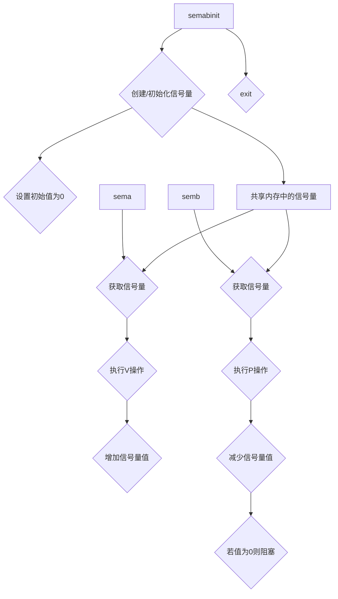

# Other — semaphoreExamples

# Other — semaphoreExamples 模块文档

## 功能概述

`semaphoreExamples` 是一个用于演示 POSIX 信号量（Semaphore）机制的示例程序集合。该模块包含三个 C �源文件：`semabinit.c`、`sema.c` 和 `semb.c`，分别对应初始化信号量和两个操作信号量的进程。

这些程序通过共享内存中的信号量实现同步控制，使得 `sema` �与 `semb` 的执行顺序受到约束。例如，当运行 `semb` 时它会等待 `sema` 执行一次后才能继续进行；如果 `sema` 被执行两次，则 `semb` 可以执行两次。

## �架构说明

### 文件结构

- **semabinit.c**  
  初始化一个具有特定键值（KEY=1492）的信号量，并将其初始值设置为 0。
  
- **sema.c**  
  获取已存在的信号量并对其执行 V 操作（增加计数器），表示释放资源或允许其他进程继续执行。

- **semb.c**  
  获取已存在的信号量并对其执行 P �操作（减少计数器），若信号量值为 0 则阻塞直到有可用资源。

### 关键组件

#### 信号量相关函数

| 函数名         | 描述 |
|----------------|------|
| `semget()`     | 根据外部标识符获取信号量 ID |
| `semop()`    | 对指定信号量执行操作（P 或 V） |
| `semctl()`   | 控制信号量属性 |

#### 数据结构

```c
struct sembuf {
    unsigned short sem_num; /* 信号量数组中索引 */
    short sem_op;        /* 操作类型：+1 表示 V，-1 表示 P */
    int sem_flg;            /* 控制是否阻塞 */
};
```

```c
union semun {
    int val;
    struct semid_ds *buf;
    ushort *array;
};
```

## 使用方法

### 编译步骤

所有程序都使用标准 C 编译器编译：

```bash
gcc -o semabinit semabinit.c
gcc -o sema sema.c
gcc -o semb semb.c
```

### 初始化信号量

在运行 `sema` 或 `semb` 前，必须先调用 `semabinit` �以创建并初始化信号量：

```bash
./semabinit
# 输出：
Semaphore 1492 initialized.
```

> 注意：该程序需要 root 权限或者系统配置支持 IPC 创建权限。

### 同步执行流程

1. 首先启动 `semb` 程序（不带后台符号 &）：
   ```bash
   ./semb
   # 输出：
   Program semb about to do a P-operation.
   Process id is 12345
   ```

   此时 `semb` �会尝试对信号量进行 P 操作。由于信号量初始值为 0，它将被阻塞等待。

2. 在另一个终端或前台运行 `sema` 程序：
   ```bash
   ./sema
   # 输出：
   Program sema about to do a V-operation.
   Successful V-operation by program sema.
   ```

   这时 `sema` 执行了 V 操作，使信号量的值变为 1，从而唤醒之前阻塞的 `semb`。

3. 回到第一个终端继续观察输出：
   ```bash
   Successful P-operation by program semb.
   Process id is 12345
   ```

   `semb` 被成功唤醒，并完成其 P 操作。

### 示例场景说明

- 若多次运行 `sema`，则每次都会增加信号量计数。
- 多次运行 `semb` 可以依次获取资源，但前提是 `sema` 已经释放过资源。
- 如果没有运行 `semabinit` 初始化信号量，则后续程序会因无法找到信号量而退出。

## Mermaid 架构图



## 总结

本模块通过简单的示例展示了如何使用 POSIX 信号量机制实现进程间的同步控制。适用于理解 IPC 中信号量的基本用法和工作原理。