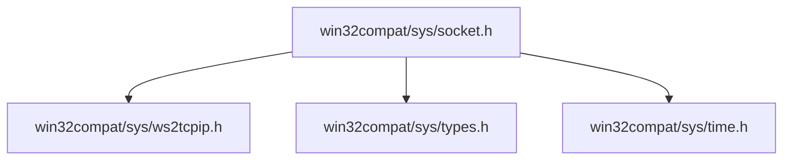

# Other — sys

# Other — sys 模块文档

## 功能概述

`Other — sys` 模块是为 Windows 平台提供 POSIX 兼容系统头文件的兼容层实现。该模块主要包含以下内容：

- `sys/socket.h`: 提供 socket 相关定义，依赖于 WinSock2 和 ws2tcpip 头文件。
- `sys/time.h`: 定义时间类型如 `time_t`。
- `sys/types.h`: 提供整数类型、大小和结构体定义（例如 `ssize_t`, `off64_t` 等）。
- `sys/ws2tcpip.h`: 包含 Windows Socket 2 的 TCP/IP 扩展接口定义。

此模块的目标是在 Windows 上模拟 Unix/Linux 系统中的部分标准 C 库行为，以便在跨平台开发中使用统一的 API 接口。

## 架构说明

本模块通过预处理器指令和宏定义来适配不同编译器环境下的数据类型与函数声明。其核心设计思想如下：

### 文件组织方式

| 文件名 | 描述 |
|--------|------|
| `socket.h` | 声明 socket 类型及常量 |
| `time.h` | 时间相关类型定义 |
| `types.h` | 各种基本数据类型的定义 |
| `ws2tcpip.h` | WinSock2 中 IPv4/IPv6 地址解析相关的扩展 |

这些头文件之间存在依赖关系：


### 数据类型处理策略

为了确保代码能在多种环境下正确运行，特别是 MSVC 编译器下，模块采用条件编译的方式对基础整数类型进行重定义：

```c
#ifdef _MSC_VER
typedef signed __int8       int8_t;
typedef unsigned __int8   u_int8_t;
// ... 更多类型定义 ...
#else
typedef signed char          int8_t;
typedef unsigned char      u_int8_t;
// ... 标准类型定义 ...
#endif
```

这使得即使在不支持 `<stdint.h>` 或类似标准的情况下也能获得一致的数据宽度保证。

### 结构体定义

模块中还包含了多个用于地址信息解析的结构体定义，包括但不限于：

- `struct ip_mreq`
- `struct in_pktinfo`
- `struct addrinfo`
- `struct sockaddr_in6`
- `struct in6_addr`

这些结构体通常配合 `getaddrinfo()`、`freeaddrinfo()`、`getnameinfo()` 等函数使用，实现网络地址的查询和转换功能。

## 使用方法

### 预处理器设置

当使用该兼容层时，请确保包含正确的头文件顺序，并且已经定义了以下宏以避免冲突：

```c
#define WIN32_LEAN_AND_MEAN
#include <windows.h>
#include <winsock2.h>
#include <sys/socket.h>  // 包含此模块的 socket.h 头文件
```

### 示例：获取主机地址信息

```c
#include <sys/socket.h>
#include <sys/types.h>
#include <netdb.h>

int main() {
    struct addrinfo hints, *result;
    memset(&hints, 0, sizeof(hints));
    hints.ai_family = AF_UNSPEC;     // 支持 IPv4 和 IPv6
    hints.ai_socktype = SOCK_STREAM;

    if (getaddrinfo("example.com", "http", &hints, &result) == 0) {
        for (struct addrinfo* rp = result; rp != NULL; rp = rp->ai_next) {
            printf("Family: %d\n", rp->ai_family);
        }
        freeaddrinfo(result);
    }

    return 0;
}
```

### 注意事项

1. **链接库依赖**：
   - 必须链接 WinSock 库（如 `ws2_32.lib`）。
   - 若使用 IPv6 功能，则需安装相应的 IPv6 堆栈或服务包。

2. **线程安全问题**：
   - 模块本身未提供任何线程同步机制。如果需要并发访问相关 API，应自行加锁处理。

3. **版本兼容性**：
   - 对于较老的操作系统（如 NT 4），某些特性可能不可用或行为不同。
   - 推荐使用 Windows XP 及以上操作系统进行开发测试。

## 与其他模块的关系

本模块作为底层兼容接口的一部分，主要被以下模块所调用：

- 跨平台网络通信模块（例如 TCP/UDP 客户端和服务端）
- DNS 解析与域名查找模块
- 网络协议栈抽象层

它不直接参与执行流程，而是通过提供标准 C 标准中缺失的部分来支持更高层级的功能模块。因此，在构建跨平台应用程序时，它是不可或缺的基础组件之一。