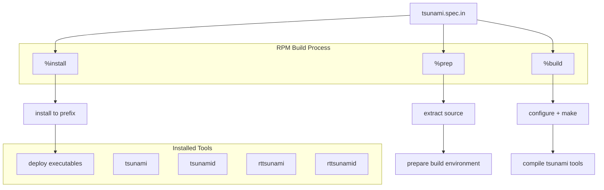

# Other — tsunami.spec.in

# tsunami.spec.in 模块文档

## 功能概述

该模块是 tsunami 软件包的 RPM spec 文件，用于定义如何构建和打包基于UDP的快速文件传输协议软件。它描述了软件的基本属性、依赖关系以及安装后的文件结构。

## 架构说明

### 基本配置参数
```
Name: tsunami
Version: @version@
Release: 1
License: Indiana University
Group: VLBI
BuildRoot: /var/tmp/tsunami-@version@-buildroot
Requires: gcc >= 4.1.0
Prefix: /usr
Source: tsunami-%{version}.tar.gz
```

### 构建流程
该spec文件定义了完整的构建生命周期：
- `%prep` 阶段：解压源码并准备构建环境
- `%build` 阶段：执行配置和编译命令
- `%install` 阶段：将编译结果安装到指定目录

### 安装内容
```
%files
%defattr(-,root,root)
%{_bindir}/tsunami
%{_bindir}/tsunamid
%{_bindir}/rttsunami
%{_bindir}/rttsunamid
```

## 使用方法

### 构建RPM包
```bash
rpmbuild -bb tsunami.spec.in
```

### 打包过程
1. **准备阶段**：使用 `%setup` 宏提取源代码
2. **构建阶段**：运行 `./configure` 和 `make` 
3. **安装阶段**：通过 `make install` 将可执行文件部署到 `$RPM_BUILD_ROOT/usr`

## 关键组件

### 主要工具
- `tsunami`: 核心文件传输客户端程序
- `tsunamid`: 服务端守护进程
- `rttsunami`: 实时数据传输工具
- `rttsunamid`: 实时数据传输服务端

### 版本管理
根据changelog信息，当前版本为0.92wb（由Walter Brisken创建），后续由Jan Wagner进行合并改进。

## 与其他模块的关系

该spec文件作为构建系统的入口点，负责协调整个软件包的编译和分发流程。它不直接参与核心功能实现，而是提供标准化的打包机制来确保软件能够正确地在目标系统上安装和运行。

## Mermaid 图表



该图表展示了从spec文件到最终安装的完整流程，包括预处理、构建和安装三个主要阶段以及它们之间的关系。