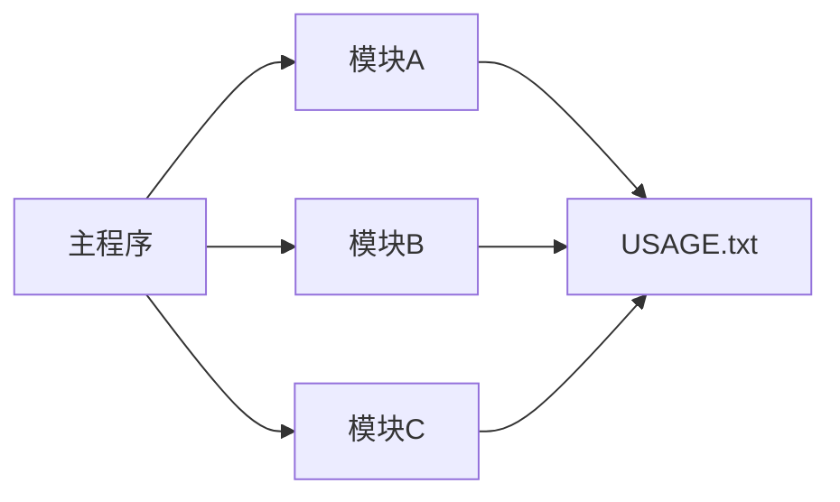

# Other — USAGE.txt

# Other — USAGE.txt

## 功能概述

USAGE.txt 文件是一个配置文件模板，用于定义系统中其他模块的使用说明和参数设置。该文件不包含可执行代码，而是提供了一种标准化的方式来记录和管理不同模块的使用方式、依赖关系以及配置选项。

## 架构设计

### 文件结构
```
USAGE.txt
├── 模块名称声明区
├── 使用说明区域
├── 参数配置列表
└── 依赖关系说明
```

### 核心组件
- **模块标识**: 定义当前模块在系统中的唯一标识符
- **功能描述**: 简要说明模块的核心功能
- **使用场景**: 描述适用的应用环境或业务场景
- **配置项**: 列出所有需要用户自定义的参数及其含义
- **依赖信息**: 明确指出该模块所依赖的其他组件

## 连接方式

此文件作为文档化接口与代码库中的其他模块进行交互：


## 使用方法

### 配置流程
1. 在 USAGE.txt 中添加新模块的使用说明
2. 定义必要的配置参数
3. 建立与其他模块的依赖关系
4. 更新主程序中的模块注册表

### 示例格式
```
[MODULE_NAME]
DESCRIPTION=模块功能描述
USAGE=使用场景说明
PARAMS=参数名=默认值(类型):说明
DEPENDENCIES=依赖模块列表
```

## 贡献指南

开发者应确保新增模块的信息完整准确，并遵循统一的格式规范来维护该文件的一致性。