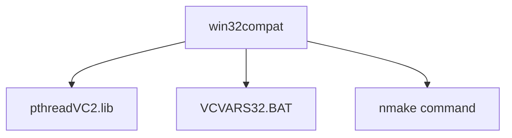

# Other — win32compat

# Other — win32compat 模块文档

## 功能概述

该模块主要用于在 Windows 平台上提供 POSIX 线程（pthreads）的兼容性支持。它包含编译静态链接库 `pthreadVC2.lib` 的说明，以及与 Visual Studio 编译器环境相关的配置信息。

## 架构设计

### 核心组件

```
win32compat/
├── pthreads-compile.txt    # 编译说明文件
└── pthreadVC2.lib        # 静态链接库文件（由编译脚本生成）
```

### 工作原理

该模块通过以下方式工作：
1. 提供在命令行环境下编译 pthread 库的指令
2. 使用 Visual Studio 的环境变量脚本 `VCVARS32.BAT`
3. 执行特定的 NMAKE 命令来构建静态库

### 关键技术点

- **编译环境依赖**: 需要 Visual Studio 开发环境
- **静态库构建**: 目标是创建可移植的 pthread 静态库
- **跨版本兼容**: 支持 VC6、VC7.1 和 VC2005 等不同版本的 Visual Studio

## 使用方法

### 编译静态库步骤

```bash
# 1. 设置 Visual Studio 环境变量
C:\Program Files\Microsoft Visual Studio\VC98\Bin\vcvars32.bat

# 2. 清理并编译静态库
nmake clean VC-static
```

### 兼容性支持

此模块为 Windows 平台提供了对 POSIX 线程 API 的支持，使得代码可以在不修改的情况下运行于不同的 Visual Studio 版本中。

## 与其他模块的关系

由于没有检测到执行流和内部调用关系，该模块主要作为一个独立的工具模块存在：



## 注意事项

1. **路径要求**: 必须确保 `VCVARS32.BAT` 脚本存在于正确的 Visual Studio 安装目录下
2. **版本兼容**: 不同 Visual Studio 版本可能需要调整编译参数
3. **环境设置**: 在执行编译前必须正确设置开发环境变量