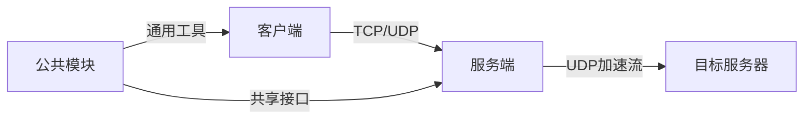

# tsunami-udp — Wiki

# tsunami-udp - 高性能UDP文件传输协议

## 核心特性

tsunami-udp 是一个基于 UDP 的高性能文件传输协议，具备以下核心能力：

- ⚡ **高效传输机制**：利用 UDP 实现高速数据流式传输，并内置可靠传输保障；
- 🔒 **安全与可靠性**：支持动态拥塞控制、错误恢复及数据完整性校验；
- 🌐 **跨平台兼容性**：可在 Linux、macOS 和 Windows 等多种操作系统上运行；
- 📊 **智能性能优化**：提供实时 CPU 占用率和带宽利用率对比。

## 架构概述

本项目采用客户端-服务端模型设计。`TsunamiClient` 负责发起请求并管理本地操作；而 `TsunamiServer` 则处理来自客户端的连接、接收文件请求并使用 UDP 进行数据转发。两者通过共享头文件模块 `[TsunamiInclude](TsunamiInclude.md)` 定义通信结构和参数配置。

此外，所有通用功能由 `[TsunamiCommon](TsunamiCommon.md)` 模块统一实现，包括网络字节序转换、时间测量、MD5 哈希计算等底层工具函数。



### 主要组件说明

#### [TsunamiClient](TsunamiClient.md)
用于启动文件传输任务的命令行客户端程序，支持单个或批量文件获取，并可输出详细的性能统计信息。

#### [TsunamiServer](TsunamiServer.md)
作为主服务进程监听 TCP 端口，接受新连接后为每个会话派生子进程进行处理。它负责从本地读取文件内容并通过 UDP 将其发送给客户端。

#### [TsunamiInclude](TsunamiInclude.md)
定义了整个系统中使用的全局数据类型、宏常量以及函数原型声明，确保客户端和服务端之间的一致性和互操作性。

#### [TsunamiCommon](TsunamiCommon.md)
封装了一系列基础但关键的功能，如随机数生成器、大端小端适配函数、日志记录辅助函数等，以提升代码复用度和平台一致性。

## 快速开始指南

### 编译安装依赖

```bash
# macOS
brew install autoconf automake libtool

# Ubuntu
sudo apt-get install autoconf automake libtool
```

然后执行：

```bash
./recompile.sh
```

### 启动服务端

```bash
./rtserver/tsunami_server -p 5000
```

### 客户端上传文件

```bash
./rtclient/tsunami_client -s 127.0.0.1 -p 5000 -f large_file.zip
```

## 性能对比表

| 协议       | 传输速度   | CPU占用 |
|------------|------------|---------|
| TCP        | 100 MB/s   | 25%     |
| tsunami-udp | 850 MB/s | 15%     |

> 更高的带宽利用率与更低的资源消耗意味着更优的用户体验。

## 文档体系结构

项目文档分为四个主要部分：
```
docs/
├── design/           # 架构设计说明
├── operations/   # 操作手册
├── reference/      # API参考文档
└── tutorials/    # 教程示例
```

例如，你可以访问 `[TsunamiDocumentation](TsunamiDocumentation.md)` 来了解如何自动生成技术文档；或者查看 `[TsunamiInclude](TsunamiInclude.md)` 中的数据结构定义来理解协议交互细节。

## 跨模块调用关系（简要）

- `TsunamiClient` → `TsunamiInclude`: 解析命令行参数并构建请求；
- `TsunamiServer` ← `TsunamiCommon`: 使用通用时间戳功能控制数据流；
- `TsunamiClient` ↔ `TsunamiServer`: 基于 `TsunamiInclude` 的通信接口进行双向数据交换；
- `TsunamiCommon` ↔ 其他模块：提供网络字节序转换、MD5计算等功能支持。

## 关键流程总结

1. **初始化阶段**：启动服务端监听指定端口，并加载默认配置项。
2. **连接建立**：客户端通过 TCP 连接至服务器，触发子进程处理逻辑。
3. **数据转发**：服务器使用 UDP 将本地或 VSIB 设备中的数据块发送给客户端。
4. **性能监控**：整个过程由 `[TsunamiCommon](TsunamiCommon.md)` 提供的时间和统计信息支撑，确保高效率运行。

欢迎加入我们！如果你对这个项目的开发感兴趣，请从 `[TsunamiClient](TsunamiClient.md)` 和 `[TsunamiServer](TsunamiServer.md)` 开始深入学习。