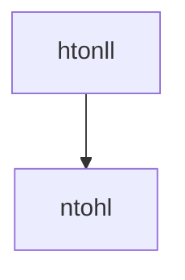
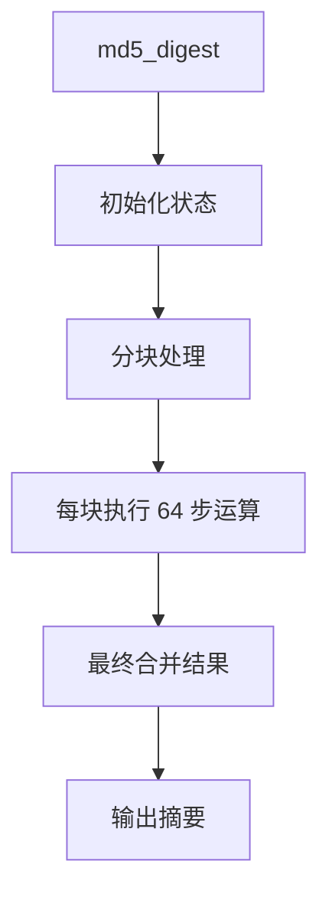

# TsunamiCommon

# TsunamiCommon 模块文档

## 功能概述

`TsunamiCommon` 是一个共享模块，为 Tsunami 客户端和服务器提供通用的、跨平台的功能实现。它包含了一系列底层工具函数，用于处理网络字节序转换、随机数据生成、时间测量、MD5 哈希计算以及文件名格式化等任务。

该模块的设计目标是支持多平台（Unix 和 Win32）环境下的统一行为，并确保在不同架构下（如大端或小端系统）能够正确执行关键操作。

## 架构与组件

### 核心功能模块

#### 网络字节序处理 (`htonll`, `ntohll`)
- 提供了将 64 位整数从主机字节序转换为网络字节序（反之亦然）的支持。
- 实现依赖于 `htons()` 的判断来决定是否需要进行转换，以适应不同的平台特性。



#### 随机数据获取 (`get_random_data`)
- 使用 `/dev/urandom` 或 Windows 平台上的 CryptoAPI 获取加密安全的随机数据。
- 返回值表示成功与否：0 表示成功，-1 表示失败。

#### 时间相关 (`get_usec_since`, `make_transcript_filename`)
- `get_usec_since`: 计算自给定时间以来经过的微秒数。
- `make_transcript_filename`: 创建符合标准格式的时间戳文件名字符串。

#### MD5 消息摘要 (`md5_digest`, `prepare_proof`)
- 实现了一个完整的 MD5 消息摘要算法，适用于多种平台。
- `prepare_proof`: 将秘密密钥与缓冲区内容进行 XOR 运算后生成 MD5 哈希作为证明。

#### 文件读取辅助 (`read_line`, `fread_line`)
- 提供非缓冲行读取接口，分别针对文件描述符和 FILE 流。
- 支持按行读取输入并自动去除换行符。

#### 精确睡眠控制 (`usleep_that_works`)
- 在 Unix 上使用 `select()` + 自旋方式，在 Win32 上则通过 `Sleep()` + 性能计数器实现高精度延迟。

#### UDP 错误统计 (`get_udp_in_errors`)
- 仅在 Linux 下有效，尝试从 `/proc/net/snmp` 中提取 UDP 输入错误计数。
- 其他平台返回 0。

#### 安全写入/读取 (`full_write`, `full_read`)
- 确保完整地写入或读取指定数量的数据，防止部分传输问题。
- 对底层 I/O 调用进行了封装，保证原子性。

### 全局常量定义

| 名称 | 类型 | 含义 |
|------|------|------|
| PROTOCOL_REVISION | u_int32_t | 协议版本号 (YYYYMMDD) |
| REQUEST_RETRANSMIT | u_int16_t | 请求重传 |
| REQUEST_RESTART | u_int16_t | 请求重启 |
| REQUEST_STOP | u_int16_t | 请求停止 |
| REQUEST_ERROR_RATE | u_int16_t | 请求错误率 |

## 多平台兼容性设计

模块包含两个主要源文件：
- `common.c`: Unix 版本的核心实现
- `common_win32.c`: Win32 版本的兼容实现

两者共享大部分逻辑代码，但对特定于平台的部分（如时间获取、随机数生成）采用不同的策略：

- **Unix**: 使用系统调用 `open()`, `read()`, `gettimeofday()` 和 `htonl()` 来处理字节序转换等任务。
- **Win32**: 使用 Windows API 如 `CryptAcquireContext()` 和 `GetSystemTimeAsFileTime()` 替代对应功能，并提供自定义的 `gettimeofday()` 实现。

## 关键函数说明

### 函数列表

```c
int get_random_data(u_char *buffer, size_t bytes);
u_int64_t get_usec_since(struct timeval *old_time);
u_int64_t htonll(u_int64_t value);
char *make_transcript_filename(char *buffer, time_t epoch, const char *extension);
u_char *prepare_proof(u_char *buffer, size_t bytes, const u_char *secret, u_char *digest);
int read_line(int fd, char *buffer, size_t buffer_length);
int fread_line(FILE *f, char *buffer, size_t buffer_length);
void usleep_that_works(u_int64_t usec);
u_int64_t get_udp_in_errors();
ssize_t full_write(int fd, const void *buf, size_t count);
ssize_t full_read(int fd, void *buf, size_t count);
```

### 核心算法流程图：MD5 摘要计算过程



## 连接与依赖关系

`TsunamiCommon` 被多个子模块和组件所使用，其核心接口被广泛应用于以下场景中：

- 客户端和服务端协议交互中的数据校验
- 时间戳生成及日志记录
- 网络通信的数据序列化/反序列化
- 日志转储文件名构造
- 高精度定时器控制机制

例如，在如下调用链中可以看到它的使用方式：

```text
main (util/readtest.c) → gettimeofday (common/common_win32.c)
command_get (client/command.c) → gettimeofday (common/common_win32.c)
```

此外，它还作为 MD5 计算的核心依赖项出现在 `prepare_proof()` 中。