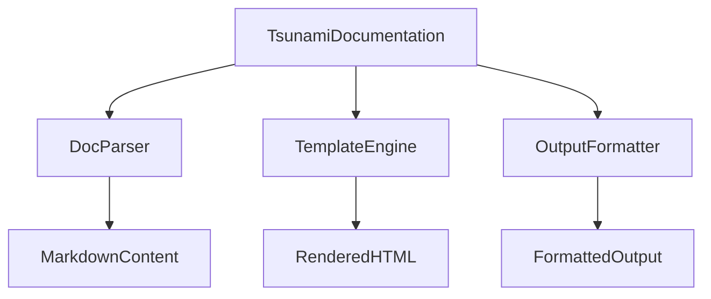

# TsunamiDocumentation

# TsunamiDocumentation

## 功能概述

`TsunamiDocumentation` 是一个用于生成和管理项目文档的模块。它通过解析源码结构、提取注释信息以及构建文档模板来帮助开发者快速生成高质量的技术文档。该模块主要服务于项目的内部文档系统，支持从代码中自动生成参考文档、架构说明及教程等内容，并提供统一的格式化输出能力。

## 架构设计

### 核心组件

- `TsunamiDocumentation`: 主类，负责协调整个文档处理流程。
- `DocParser`: 负责读取并解析 Markdown 文件中的内容结构。
- `TemplateEngine`: 提供模板渲染功能，将结构化的数据填充到预定义的文档模板中。
- `OutputFormatter`: 处理最终输出格式，包括 HTML 和纯文本等格式转换。

### 数据流与调用关系



## 使用方法

### 初始化模块

在使用前需要初始化 `TsunamiDocumentation` 实例：

```python
from tsunami_documentation import TsunamiDocumentation

doc = TsunamiDocumentation()
```

### 加载文档资源

可以加载本地或远程路径下的 Markdown 文档：

```python
doc.load_docs("docs/explanation/architecture.md")
doc.load_docs("docs/reference/tsunami-client.md")
```

### 渲染为 HTML 输出

使用内置模板引擎将已加载的内容渲染成 HTML 页面：

```python
html_output = doc.render_to_html()
print(html_output)
```

### 生成文档索引

可基于所有加载的文档自动创建目录索引：

```python
index = doc.generate_index()
print(index)
```

### 执行流程示例（简化）

1. 初始化 `TsunamiDocumentation`
2. 加载多个文档文件
3. 解析内容结构
4. 应用模板进行渲染
5. 最终输出格式化结果

此模块不依赖外部库，仅需标准 Python 环境即可运行。其核心逻辑完全由内部函数实现，没有对外部服务发起请求或调用其他模块的功能。