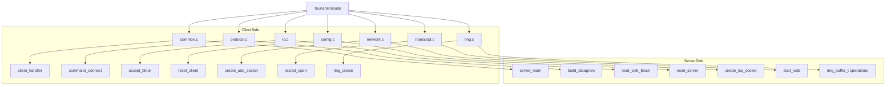

# TsunamiInclude

# TsunamiInclude 模块文档

## 模块概述

`TsunamiInclude` 是 Tsunami 文件传输协议的头文件集合模块，用于定义客户端和服务器端共享的数据结构、常量及函数原型。该模块为整个 Tsunami 协议系统提供统一接口与类型定义。

## 功能说明

本模块主要功能包括：

- 定义协议中使用的全局数据结构（如 `command_t`, `statistics_t`, `ring_buffer_t` 等）
- 提供协议参数配置相关的宏定义和默认值设置
- 声明核心通信函数接口，便于实现跨平台兼容性
- 包含错误处理机制以及 MD5 加密相关声明

## 架构设计

### 核心数据结构

```c
typedef struct {
    u_char              count;
    const char         *text[MAX_COMMAND_WORDS];
} command_t;

typedef struct {
    struct timeval      start_time;
    struct timeval      stop_time;
    struct timeval      this_time;
    u_int32_t           this_blocks;
    u_int32_t           total_blocks;
    ...
} statistics_t;

typedef struct {
    u_char             *datagrams;
    int                 datagram_size;
    int                 base_data;
    int                 count_data;
    int                 count_reserved;
    pthread_mutex_t     mutex;
    pthread_cond_t      data_ready_cond;
    int                 data_ready;
    pthread_cond_t      space_ready_cond;
    int                 space_ready;
} ring_buffer_t;
```

这些结构体分别代表命令解析、统计信息收集和环形缓冲区管理的核心状态容器。

### 全局变量与常量

#### 默认配置项

| 名称 | 类型 | 描述 |
|------|------|------|
| DEFAULT_BLOCK_SIZE | u_int32_t | 数据块默认大小 |
| DEFAULT_TABLE_SIZE | int | 重传表初始大小 |
| DEFAULT_SERVER_NAME | char* | 远程服务端名称 |
| DEFAULT_UDP_BUFFER | u_int32_t | UDP接收缓冲区大小 |

#### 请求类型标识符

| 名称 | 值 | 描述 |
|------|----|------|
| REQUEST_RETRANSMIT | 0x1001 | 请求重传 |
| REQUEST_RESTART | 0x1002 | 请求重启 |
| REQUEST_STOP | 0x1003 | 请求停止 |
| REQUEST_ERROR_RATE | 0x1004 | 错误率请求 |

### 函数接口

#### 命令处理类函数

```c
int            command_close         (command_t *command, ttp_session_t *session);
ttp_session_t *command_connect       (command_t *command, ttp_parameter_t *parameter);
int            command_get           (command_t *command, ttp_session_t *session);
int            command_help          (command_t *command, ttp_session_t *session);
int            command_quit          (command_t *command, ttp_session_t *session);
int            command_set           (command_t *command, ttp_parameter_t *parameter);
int            command_dir           (command_t *command, ttp_session_t *session);
```

#### 网络通信相关函数

```c
int            create_tcp_socket     (ttp_session_t *session, const char *server_name, u_int16_t server_port);
int            create_udp_socket     (ttp_parameter_t *parameter);
int            accept_block        (ttp_session_t *session, u_int32_t block_index, u_char *block);
```

#### 协议交互函数

```c
int            ttp_authenticate    (ttp_session_t *session, u_char *secret);
int            ttp_negotiate       (ttp_session_t *session);
int            ttp_open_transfer       (ttp_session_t *session, const char *remote_filename, const char *local_filename);
int            ttp_request_retransmit  (ttp_session_t *session, u_int32_t block);
int            ttp_update_stats      (ttp_session_t *session);
```

## 模块依赖关系图（Mermaid）



## 使用方法

### 初始化客户端参数

```c
ttp_parameter_t param;
memset(&param, 0, sizeof(param));
param.server_name = "localhost";
param.server_port = DEFAULT_TCP_PORT;
param.client_port = DEFAULT_UDP_PORT;
param.block_size = DEFAULT_BLOCK_SIZE;
param.verbose_yn = 1;
param.passphrase = DEFAULT_SECRET;

reset_client(&param);
```

### 启动传输会话

```c
command_t cmd;
cmd.count = 2;
cmd.text[0] = "get";
cmd.text[1] = "/path/to/file";

ttp_session_t session;
session.parameter = &param;
command_get(&cmd, &session);
```

### 管理环形缓冲区

```c
ring_buffer_t *rb = ring_create(&session);

// 写入数据块
u_char *blk = ring_reserve(rb);
memcpy(blk, data, size);
ring_confirm(rb); // 提交写入

// 读取数据块
u_char *rblk = ring_pop(rb);
if (rblk != NULL) {
    process_data(rblk);
}
```

## 注意事项

- 所有结构体字段均使用标准类型定义，确保跨平台一致性。
- `pthread_mutex_t` 和 `pthread_cond_t` 的使用需注意线程安全问题。
- 默认配置项应根据实际网络环境进行调整以优化性能。

## 版本信息

该模块基于 Tsunami 协议版本号 `TSUNAMI_CVS_BUILDNR` 进行维护。当前协议修订版为 `PROTOCOL_REVISION`。