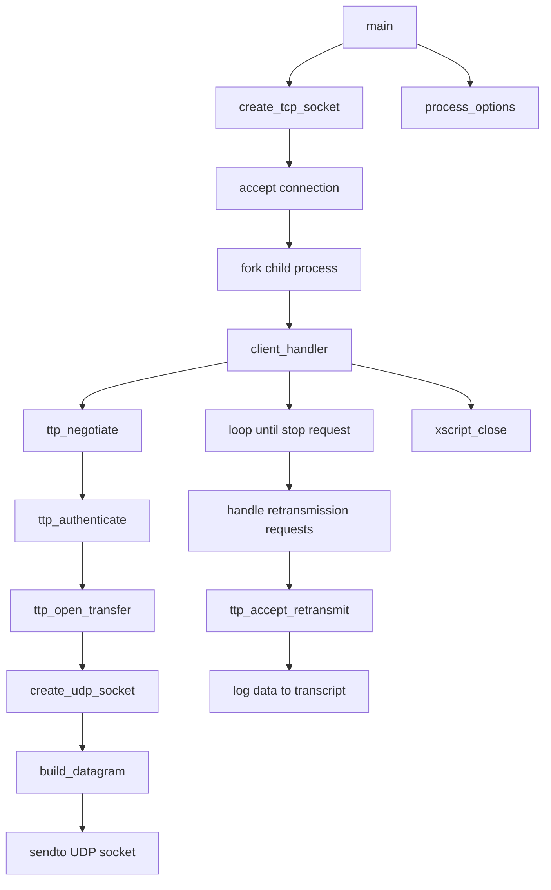

# TsunamiServer

# TsunamiServer 模块文档

## 功能概述

TsunamiServer 是一个用于文件传输的服务器模块，支持通过 TCP 和 UDP 协议进行数据流式传输。它实现了 TTP（Tsunami Transfer Protocol）协议，并提供基本的认证、连接管理、以及基于时间戳的数据发送控制功能。

该模块主要用于：
- 接收来自客户端的 TCP 连接请求并为每个连接创建子进程处理；
- 处理客户端发起的文件获取请求；
- 根据配置参数读取本地文件或从 VSIB 设备读取实时数据；
- 使用 UDP 发送数据块给客户端；
- 记录传输过程中的统计数据到日志文件中。

## 架构设计

### 主要组件

#### `main.c`
主程序入口点，负责初始化服务器参数、监听 TCP 端口、接受新连接并派生子进程来处理每个客户端会话。

关键函数包括：
- `main()`：启动服务循环。
- `client_handler(ttp_session_t*)`：在子进程中运行，处理单个客户端会话的所有逻辑。
- `process_options(int argc, char *argv[], ttp_parameter_t*)`：解析命令行选项并设置服务器参数。
- `reap(int signum)`：信号处理器，回收已终止子进程资源。

#### `io.c`
包含与磁盘 I/O 相关的功能，如构建数据包等。

主要函数：
- `build_datagram(ttp_session_t*, u_int32_t block_index, u_int16_t block_type, u_char* datagram)`：构造指定索引和类型的文件块数据包。

#### `network.c`
网络相关操作实现，例如创建 TCP 或 UDP 套接字。

主要函数：
- `create_tcp_socket(ttp_parameter_t*)`：建立 TCP 服务器套接字。
- `create_udp_socket(ttp_parameter_t*)`：建立 UDP 数据传输套接字。

#### `protocol.c`
核心协议交互部分，定义了如何协商、验证和打开传输通道。

主要函数：
- `ttp_negotiate(ttp_session_t*)`：确认客户端和服务端使用的协议版本一致。
- `ttp_authenticate(ttp_session_t*, const u_char*)`：执行双向身份验证流程。
- `ttp_open_transfer(ttp_session_t*)`：接收客户端请求的文件名并准备开始传输。
- `ttp_accept_retransmit(ttp_session_t*, retransmission_t*, u_char*)`：响应重传请求，包括错误率调整、重新发送特定块或重启传输。

#### `log.c`
通用日志记录机制。

主要函数：
- `log(FILE*, const char*, ...)`：将消息写入日志文件，并附带时间戳和 PID。

#### `transcript.c`
用于生成详细传输统计信息的日志文件。

主要函数：
- `xscript_open(ttp_session_t*)`：为当前会话创建新的 transcript 文件。
- `xscript_data_start(ttp_session_t*, const struct timeval*)`：标记数据段开始。
- `xscript_data_log(ttp_session_t*, const char*)`：向 transcript 写入一行日志。
- `xscript_close(ttp_session_t*, u_int64_t delta)`：关闭 transcript 并输出最终统计数据。

## 使用方法

### 启动命令示例

```bash
# 默认方式启动
tsunamid

# 指定端口
tsunamid --port=8080

# 设置共享密钥（secret）
tsunamid --secret=mySecretKey

# 开启详细模式
tsunamid --verbose

# 记录传输过程中的统计数据
tsunamid --transcript

# 显示帮助信息
tsunamid --help
```

### 协议交互流程

当一个客户端连接到 TsunamiServer 时，其典型交互顺序如下：

1. **TCP 连接建立**  
   - 客户端发起 TCP 连接至服务端指定端口；
   - Server 接受连接后 fork 新子进程处理该客户端。

2. **TTP 协议协商**
   - Server 发送自己的协议版本号；
   - Client 回复自己的协议版本号；
   - 若不匹配则终止连接；否则继续下一步。

3. **认证阶段**
   - Server 生成随机数并发送给 Client；
   - Client 对随机数进行加密运算后返回 MD5 值；
   - Server 验证 MD5 是否正确；
   - 成功则允许后续操作，失败则拒绝连接。

4. **打开传输通道**
   - Client 请求要获取的文件名；
   - Server 尝试打开该文件；
   - 如果成功，则告知 Client 可以开始接收数据；
   - 否则通知 Client 失败原因。

5. **UDP 数据传输**
   - Server 创建 UDP socket 并绑定地址；
   - 根据 block_size 和 target_rate 构造数据包；
   - 使用 `build_datagram()` 函数构建每个块的数据内容；
   - 通过 `sendto()` 实际发送数据块。

6. **重传机制**
   - Client 在特定条件下可能请求重新发送某些块；
   - Server 收到请求后调用 `ttp_accept_retransmit()` 来响应；
   - 包括错误率调整、重启传输等行为。

7. **统计记录**
   - 若启用 transcript 功能，会将整个传输期间的信息写入日志文件；
   - 日志包含起止时间、总字节数、目标速率、实际吞吐量等关键指标。

## 执行流图解



## 注意事项

- 当前模块支持 IPv4 和 IPv6 的混合模式（默认使用 IPv4）。
- 文件大小和 block 数量由服务器端计算得出，并在协商过程中传递给客户端。
- 如果启用了 VSIB_REALTIME 编译标志，模块可以处理来自 `/dev/vsib` 设备的数据流。
- 模块依赖于标准 POSIX 系统库函数如 `socket`, `bind`, `listen`, `accept`, `fork`, `waitpid`, `getaddrinfo`, `fopen`, `fclose`, `read`, `write` 等。