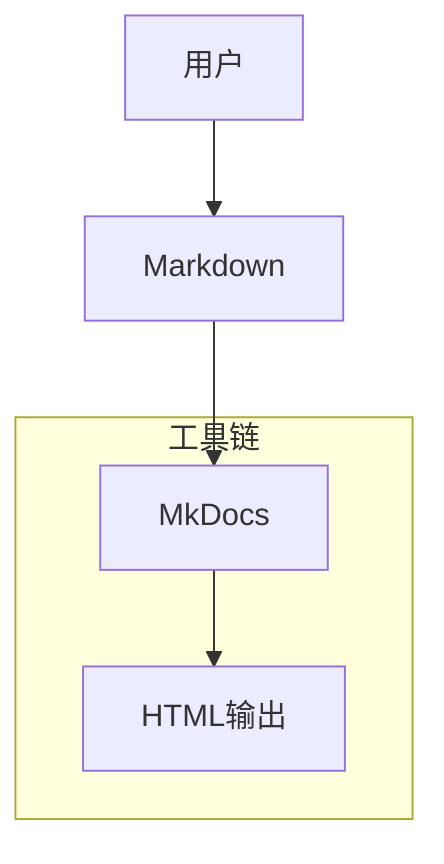

# Other — docs

# tsunam_udp 文档体系模块

该模块负责管理 `tsunami-udp` 项目的文档基础设施，包括目录结构、编写规范以及构建工具配置。它为项目提供统一的文档组织方式，并确保所有文档内容符合开发团队的标准。

## 目录结构

```text
docs/
├── tutorials/          # 入门教程和使用指导
├── how-to-guides/      # 实用操作指南
├── reference/        # API接口说明
├── explanation/        # 技术概念阐述
└── assets/             # 图表及静态资源文件
```

## 核心功能

### 文档构建脚本
`docs/build.sh` 是一个 Bash 脚本，用于自动化文档构建流程：

```bash
#!/bin/bash
# 文档构建脚本
pip install mkdocs
mkdocs build
```

此脚本通过 pip 安装 MkDocs 并运行构建命令来生成最终的 HTML 文档站点。

### 文档标准

1. **可执行性**：所有代码示例必须能够直接运行并验证其正确性。
2. **完整性**：每个文档应是独立且完整的，不依赖外部上下文。
3. **语言风格**：采用主动语态和现在时态以提高清晰度。
4. **版本一致性**：文档版本需与源码发布的版本保持同步更新。

### 架构支持工具

| 工具名称     | 功能描述                   |
|--------------|----------------------------|
| MkDocs       | 主要文档生成框架           |
| Doxygen      | C++/C 风格的 API 文档生成器 |
| PlantUML     | 系统架构图绘制工具         |

这些工具协同工作，共同维护整个文档系统的质量与一致性。

## 使用方法

开发者可通过以下步骤快速开始阅读或贡献文档：
1. 查看 `tutorials/quickstart.md` 开始学习基础使用；
2. 在本地环境中安装所需工具链（如 MkDocs）；
3. 运行 `build.sh` 来预览当前文档状态；
4. 提交修改至相应子目录下的 Markdown 文件中。

## 示例调用关系

