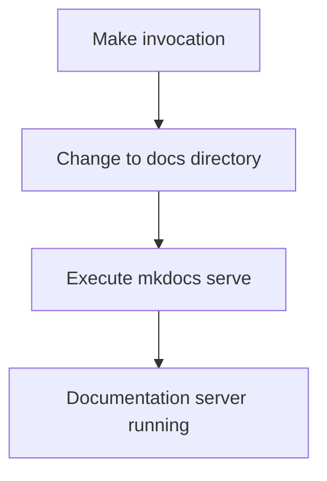

# Other — Makefile

# Other — Makefile

This module provides a Makefile containing build automation rules for documentation preview functionality.

## Purpose

The primary purpose of this Makefile is to enable developers to quickly start a local documentation server for previewing changes during development. It specifically targets the `mkdocs` documentation system used in this project.

## Key Components

### `docs-preview` target

```makefile
docs-preview:
	cd docs && mkdocs serve
```

This rule performs two main operations:
1. Changes directory to `docs/`
2. Executes `mkdocs serve` command to start the documentation preview server

## Functionality

When executed, this makefile target will:
- Navigate into the `docs` directory
- Launch MkDocs' built-in development server
- Serve documentation on localhost (default port 8000)
- Enable live reloading for faster development workflow

## Usage

To use this functionality:

```bash
make docs-preview
```

This will start the documentation server at http://localhost:8000 where developers can view their documentation changes in real-time.

## Integration

This Makefile integrates with the broader project by providing an easy way to access documentation previews without requiring explicit knowledge of the underlying MkDocs configuration or commands. It serves as a bridge between the standard development workflow and documentation building tools.

## Dependencies

Requires:
- MkDocs installed in the environment (`pip install mkdocs`)
- A valid `mkdocs.yml` configuration file in the `docs/` directory
- The `docs/` directory exists and contains documentation files

## Architecture Notes

No complex internal dependencies exist within this makefile itself. The execution flow is straightforward:


This simple dependency graph reflects that this makefile acts as a thin wrapper around existing documentation tooling rather than implementing complex logic.