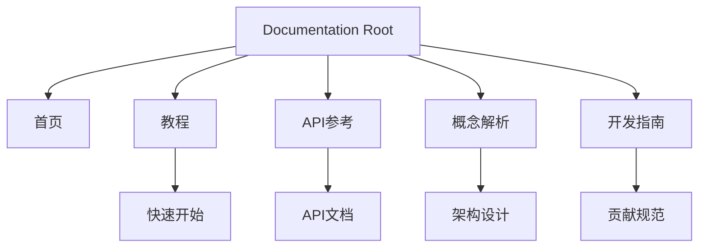

# Other — mkdocs.yml

# MkDocs Configuration Module

This module defines the `mkdocs.yml` configuration file that controls the documentation site generation process for the tsunami-udp project using MkDocs.

## Purpose

The primary purpose of this configuration is to define the structure, appearance, and behavior of the documentation website. It serves as the central configuration point for:

- Site metadata and branding
- Theme selection and customization
- Plugin integration for enhanced functionality
- Markdown extension settings
- Navigation hierarchy

## Key Components

### Site Metadata
```yaml
site_name: tsunami-udp
repo_url: https://github.com/your-repo/tsunami-udp
```
Sets the display name of the documentation site and links to the source repository.

### Theme Configuration
```yaml
theme:
  name: material
  features:
    - navigation.tabs
```
Uses the Material theme with tab-based navigation support, providing a modern and responsive UI experience.

### Plugins
```yaml
plugins:
  - search
  - markdownextradata
```
Enables:
- Built-in search functionality for easy content discovery
- Markdown extra data plugin for injecting variables into markdown files

### Markdown Extensions
```yaml
markdown_extensions:
  - admonition
  - toc:
      permalink: true
  - pymdownx.superfences
```
Configures extensions that enhance markdown rendering:
- Admonitions for note/warning callouts
- Table of contents with permalinks
- Super fences for better code block handling

### Extra Variables
```yaml
extra:
  version: 1.0.0
```
Defines additional metadata available throughout the documentation.

### Navigation Structure
```yaml
nav:
  - 首页: index.md
  - 教程:
    - 快速开始: tutorials/quickstart.md
  - API参考: reference/index.md
  - 概念解析:
    - 架构设计: explanation/architecture.md
  - 开发指南:
    - 贡献规范: CONTRIBUTING.md
```

## Architecture Overview

The mkdocs.yml configuration establishes a hierarchical navigation system that organizes documentation content logically:



This structure provides clear pathways for different user types:
- New users start at "首页" and "教程"
- Developers reference "API参考"
- Technical readers explore "概念解析"
- Contributors follow "开发指南"

## Integration Points

This configuration file is processed by MkDocs during the build process and integrates with other project components through:

1. **Markdown Files**: The navigation references actual markdown documents in the project
2. **Theme System**: Material theme components are used across all pages
3. **Plugin System**: Search and data injection plugins work across the entire site
4. **Version Management**: The extra.version variable can be referenced in templates

## Configuration Best Practices

### Consistent Naming
All paths use consistent naming conventions (e.g., `tutorials/`, `reference/`) to maintain clarity.

### Logical Organization
Navigation follows a logical progression from general information to specific technical details, supporting progressive disclosure of knowledge.

### Extensibility
The modular approach allows adding new sections without disrupting existing navigation structures.

## Usage Notes

This configuration file should remain in the root directory of the documentation source tree. Changes to this file require rebuilding the documentation site using MkDocs commands such as:

```bash
mkdocs serve
# or
mkdocs build
```

The configuration does not define any internal execution flows since it's purely declarative — no runtime logic exists within this file itself.