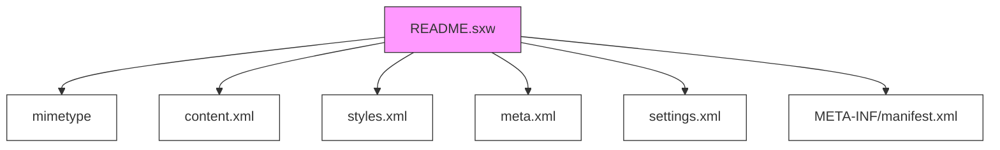

# Other — README.sxw

# README.sxw Module Documentation

## Overview

The `README.sxw` file is an OpenDocument Writer file (`.sxw`) that contains metadata and content related to a document in the OpenOffice.org format. This module represents the internal structure of such a file as part of a larger system or tooling process, likely used for processing or analyzing `.sxw` documents.

This file is structured like a ZIP archive containing multiple XML-based files:
- `mimetype`
- `content.xml`
- `styles.xml`
- `meta.xml`
- `settings.xml`
- `META-INF/manifest.xml`

It does not contain executable logic but rather serves as a data container with specific formatting requirements typical of OpenDocument formats.

## Purpose

This module acts as a representation or abstraction of an OpenDocument Writer file (`*.sxw`). It may be used by tools that need to parse, validate, or manipulate `.sxw` documents without direct access to the full file system or complex libraries.

Its main role is to encapsulate the structure and contents of a `.sxw` file so that downstream systems can treat it as a unit for operations like:

- Metadata extraction
- Content analysis
- File validation
- Document conversion or transformation

## Structure

### ZIP Archive Format

The file follows the standard ZIP archive layout where each entry consists of:

1. **Local File Header**
2. **File Data**
3. **Data Descriptor** *(optional)*

Each file inside the archive has a header indicating its size, compression method, and other attributes.

### Key Files Inside the Archive

#### mimetype
- Contains the MIME type string: `application/vnd.sun.xml.writer`.
- Used to identify the file format.
- Stored uncompressed at the beginning of the archive.

#### content.xml
- Main document content stored in XML format.
- Includes text paragraphs, tables, images, etc., depending on the actual document.

#### styles.xml
- Defines styling information applied to elements within the document.
- Stores font definitions, paragraph styles, character styles, etc.

#### meta.xml
- Holds metadata about the document including:
  - Generator version
  - Creation date
  - Print date
  - Editing cycles and duration
  - User-defined properties

Example snippet from `meta.xml`:
```xml
<meta:generator>OpenOffice.org 1.1.3 (Linux)</meta:generator>
<meta:creation-date>2006-05-12T10:17:41</meta:creation-date>
<dc:date>2006-05-12T11:08:58</dc:date>
<meta:user-defined meta:name="Info 1"/>
```

#### settings.xml
- Configuration settings related to the document's view or editing behavior.
- May include things like default fonts, page setup options, etc.

#### META-INF/manifest.xml
- Describes the internal structure of the document.
- Lists all files included in the package along with their paths and types.

## Usage Context

While this module itself doesn't perform any actions directly, it represents a key part of how `.sxw` documents are handled in environments where they might be processed programmatically — such as:

- A document parser or converter tool
- An application that needs to inspect or extract data from OpenDocument files
- A testing framework simulating real-world `.sxw` inputs

This representation allows developers to simulate or validate against known structures when working with `.sxw` formats without needing full libraries or external dependencies.

## Mermaid Diagram

If needed to illustrate the conceptual architecture of an SXW file container:



## Notes on Execution Flow

No execution flows were detected for this module. It is purely static content representing a ZIP-based document format rather than containing logic or being invoked by other modules during runtime.

## Related Modules

This module does not depend on or interact with other code modules directly. However, it may be used in conjunction with:

- Document readers/writers handling ODF formats
- File validation utilities checking ZIP integrity
- Metadata extraction tools targeting XML components within `*.sxw` files

These would typically operate on top of or alongside this abstraction to process actual `.sxw` files.