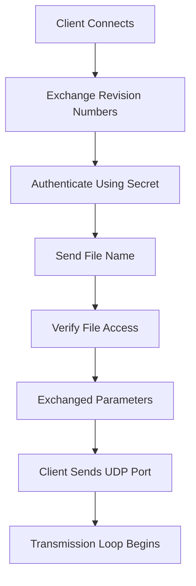

# Other — README.txt

# Tsunami Protocol README Module

This document describes the **README.txt** module which contains the original documentation for the Tsunami protocol suite. It outlines the core functionality, communication flow, authentication mechanism, and other implementation details relevant to developers working with or contributing to the Tsunami system.

## Purpose

The `README.txt` serves as an introductory guide to the Tsunami protocol, providing high-level architectural overview and operational instructions. While not comprehensive, it offers essential context about:

- How the protocol functions at a conceptual level
- Basic installation and compilation steps
- Communication patterns between client and server
- Authentication mechanisms used by the system

It is intended primarily for users who want to understand what they're installing before proceeding with actual setup and configuration.

## Overview of Operation

Tsunami implements a TCP-based file transfer protocol where clients connect to servers over TCP, authenticate using shared secrets, then initiate UDP-based data transfers. The protocol supports retransmission requests during transmission to handle errors gracefully.

### Core Components

1. **Client (`tsunami`)** - Initiates connection and handles file reception.
2. **Server (`tsunamid`)** - Listens for connections and manages file sending.
3. **Utilities (`readtest`, `writetest`)** - Benchmark disk subsystem performance.

## Communication Flow

A basic Tsunami conversation proceeds through these stages:

### Transmission Loops

#### Server Loop:
While the entire file hasn't been sent yet:
- Check if client has made a request via TCP pipe
- Service that request if present
- Otherwise send next block in file
- Delay for next packet

#### Client Loop:
While the entire file hasn't been received yet:
- Try to receive another block
- If last block, break and notify server
- Else every 50th iteration:
  - Update statistics
  - Notify server of error rate
  - Transmit queue of retransmission requests
- Save block
- Handle out-of-order blocks:
  - Add intervening blocks to retransmission queue (if later)
  - Remove from queue (if earlier)

## Retransmission Queue

The retransmission queue is implemented as a sparse array tracking requested block numbers.

Key behaviors:
- Doubles in size when full
- Tracks lowest/highest indices used
- Rehomes data periodically to base of array
- For large queues (> threshold), restarts instead of individual requests

This design allows efficient handling of missing or duplicate blocks without excessive overhead.

## Authentication Mechanism

Authentication uses a challenge-response model based on MD5 hashing:

1. Server generates 512 bits random data from `/dev/random`
2. Client XORs copies of shared secret over this random data
3. Client computes MD5 hash of result buffer
4. Server performs same operation and compares hashes
5. Connection accepted only if hashes match

Currently hardcoded password: `"kitten"`  
Can be overridden with `--secret` option.

## Implementation Notes

### Endianness
All components are endian-independent except for the MD5 implementation code.

### Large Files
Support for 64-bit file sizes using `fopen64()` / `fseeko64()` API.

### Platform Dependencies
- Uses `/dev/random` for secure randomness
- Depends on fixed-size types like `u_int32_t` (Linux) vs `uint32_t` (Solaris)
- Requires `gcc` due to use of GNU "long long" datatype for 64-bit operations
- Lacks support for systems without `getopt_long()` (e.g., Solaris)

### Known Limitations
- Disk-to-disk transfers on same box are unreliable due to scheduling daemon behavior
- Online help limited; use 'help' command for client assistance
- Usage info limited on server side; run with '--help' flag for options

## Integration Points

This module does not directly call into other modules but provides foundational documentation that guides developers through integration points such as:

- TCP port binding (`46224`)
- UDP port negotiation during transmission
- Shared secret configuration via CLI arguments
- File access verification routines

It also indirectly informs about protocol parameters defined elsewhere (in `tsunami.h`) which control version compatibility checks and tuning algorithms.

## Future Considerations

Several aspects of Tsunami remain under active development:
- Error rate response tuning logic
- Potential changes to authentication method in future releases

These areas may evolve significantly between versions, so developers should monitor updates carefully.

## References

For detailed usage instructions, see:
- COMPILING.txt
- USAGE.txt

For technical questions, subscribe to the Tsunami LISTSERV at:
http://listserv.indiana.edu/archives/tsunami-l.html