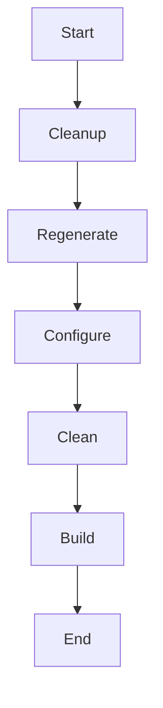

# Other — recompile.sh

# recompile.sh

A shell script used to rebuild the project from source using GNU Autotools.

## Purpose

This script serves as an automated cleanup and rebuild utility for projects that use the GNU Autotools build system. It removes existing build artifacts and regenerates configuration files before performing a fresh compilation.

## Key Components

### Cleanup Phase
```sh
rm -f configure
rm -f Makefile
rm -f Makefile.in
rm -f */Makefile
rm -f */Makefile.in
rm -rf */.deps
rm -rf autom4te.cache
```

Removes generated and cached build files to ensure a clean rebuild environment.

### Regeneration Phase
```sh
autoreconf -i -f -s
```

Runs `autoreconf` with options:
- `-i`: Install missing auxiliary files
- `-f`: Force regeneration even if files exist
- `-s`: Suppress warnings about missing auxiliary files

### Build Phase
```sh
./configure
make clean
make -j8
```

Executes the standard three-step build process:
1. Configure: Generates platform-specific Makefiles
2. Clean: Removes previous build outputs
3. Make: Compiles with 8 parallel jobs

## Usage

Run the script directly in the root directory of the project:

```bash
./recompile.sh
```

After successful execution, run:
```bash
sudo make install
```
to install binaries into `/usr/bin`.

## Notes

The script is designed for projects using autotools but does not execute all possible autotools steps (`aclocal`, `autoheader`, `automake`, `autoconf`) which are commented out. These may be needed depending on the complexity of the build setup.

For Solaris builds, specific flags can be uncommented in the configure line to handle type definitions and library dependencies.

## Diagram

