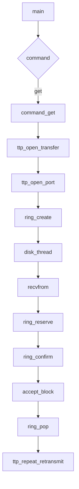

# Other — rtclient

# rtclient Module Documentation

## Purpose

The `rtclient` module is a real-time Tsunami UDP client implementation used for transferring files over a network using the Tsunami protocol. It provides a command-line interface (CLI) with support for connecting to servers, retrieving remote files, listing shared files, setting parameters, and managing sessions.

## Key Components

### Main CLI Commands

#### `close`
Closes an active connection to a Tsunami server.

#### `connect`
Establishes a TCP connection to a Tsunami server, performs authentication, and initializes session state.

#### `dir`
Requests and displays a list of available files on the remote Tsunami server.

#### `get`
Initiates retrieval of one or more files from the remote server. Supports both single-file and multi-file (`GET *`) operations.

#### `help`
Provides usage information for commands.

#### `quit`
Terminates any open connection and exits the client.

#### `set`
Modifies default parameter values or reports current settings.

### Core Functions

- `command_close()` – Closes a Tsunami control session.
- `command_connect()` – Opens a new Tsunami control session.
- `command_dir()` – Lists remote files.
- `command_get()` – Initiates file transfer(s).
- `command_help()` – Displays help text for commands.
- `command_quit()` – Exits the client.
- `command_set()` – Manages configuration parameters.

### Threading Support

- `disk_thread()` – A dedicated thread that handles writing received data blocks to disk.
- Uses POSIX threads (`pthread_create`, `pthread_join`) for asynchronous I/O processing.

### Utility Functions

- `got_block()` – Checks whether a specific block has already been received in a session.
- `parse_fraction()` – Parses fraction strings like `"nnn/ddd"` into numerator/denominator pairs.

## Execution Flow Overview

This section describes how core functionality flows through the system:

In this diagram:
- The main loop processes user input via `main()`.
- When a `get` command is issued, it calls `command_get()`.
- File transfer setup includes negotiation (`ttp_open_transfer`) and port creation (`ttp_open_port`).
- Data reception uses a ring buffer (`ring_create`) managed by `disk_thread`.
- Received datagrams are processed using `recvfrom`, which copies them into the ring buffer.
- Final writes happen asynchronously in `disk_thread`.

## Detailed Function Descriptions

### `command_get(command_t *, ttp_session_t *)`

Handles file retrieval requests including support for multiple files (`GET *`). It performs the following steps:

1. Validates command syntax and session state.
2. Initializes transfer metadata (remote/local filenames).
3. Negotiates with server to start transfer (`ttp_open_transfer`).
4. Sets up UDP socket for data transmission (`ttp_open_port`).
5. Allocates memory structures: retransmission table, bitfield tracking, ring buffer.
6. Starts background disk write thread (`pthread_create`).
7. Enters receive loop where packets arrive over UDP:
   - Packet type and block index extracted from payload.
   - Statistics updated based on packet type.
   - Duplicate detection handled via `got_block`.
   - New or missing blocks inserted into ring buffer.
8. Retransmissions triggered when gaps detected.
9. Transfer ends upon receiving termination block.
10. Finalizes statistics and flushes remaining data before closing connection.

#### Return Values

- Returns 0 on successful completion of all requested transfers.
- Returns -1 if any error occurs during transfer process.

---

### `command_connect(command_t *, ttp_parameter_t *)`

Establishes a new Tsunami control session over TCP.

Steps include:
1. Parsing host/port arguments from command line.
2. Creating a TCP socket using `create_tcp_socket`.
3. Converting socket descriptor to stream (`fdopen`).
4. Performing protocol negotiation (`ttp_negotiate`).
5. Authenticating against server using shared secret (`ttp_authenticate`).

#### Return Value

- On success returns pointer to initialized `ttp_session_t`.
- On failure returns NULL.

---

### `command_dir(command_t *, ttp_session_t *)`

Requests directory listing from remote Tsunami server.

1. Ensures valid session exists.
2. Sends request (`TS_DIRLIST_HACK_CMD`).
3. Reads number of files returned.
4. Loops through each file name and size printing results.
5. Writes final null byte back to server as acknowledgment.

#### Return Value

- Returns 0 on success.
- Non-zero value indicates an error occurred.

---

### `disk_thread(void *)`

Dedicated thread responsible for writing received data blocks to disk.

This function operates until it receives a special block with index zero indicating shutdown.

It uses:
- `ring_peek()` – Retrieves next available block.
- `accept_block()` – Writes block contents to local file.
- `ring_pop()` – Removes processed block from ring.

The thread exits cleanly after popping the stop marker.

---

## Configuration Parameters

| Parameter              | Description                                  |
|--------------------------|----------------------------------------------|
| `server_name`          | Hostname/IP address of Tsunami server       |
| `server_port`          | Port number used by Tsunami server         |
| `client_port`          | Local port used for UDP communication     |
| `block_size`           | Size in bytes of each data block            |
| `udp_buffer`           | Buffer size for UDP socket                |
| `verbose_yn`             | Enable verbose output                     |
| `transcript_yn`        | Enable transcript logging               |
| `ipv6_yn`              | Use IPv6 instead of IPv4                  |
| `output_mode`            | Output mode (screen or line)              |
| `target_rate`          | Target throughput rate                    |
| `error_rate`             | Expected packet loss rate                   |
| `lossless`               | Enforce lossless transfers                 |
| `losswindow_ms`        | Time window for semi-lossy retransmit    |
| `history`                | History buffer percentage                 |
| `passphrase`             | Shared authentication key                 |

These parameters are managed via the `set` command, which allows users to configure defaults before initiating connections.

## Integration Points

### External Dependencies
- `tsunami-client.h`: Core client-side APIs including session management, transfer initiation, and statistics reporting.
- `pthread.h`: Threading support required for background I/O handling.
- `vsibctl.h`, `vsib_ioctl.h`: VSI Brute hardware control interfaces; not directly involved but may be referenced during build-time configuration.

### Internal Calls Within Module
- `command_get()` → `got_block()`
- `parse_fraction()` → `warn()`
- `disk_thread()` → `ring_pop()`, `accept_block()`
- `command_set()` → `error()`, `warn()`

### Cross-Module Execution Flows
- `command_get()` calls into `ttp_open_transfer`, `ttp_open_port`, etc., defined elsewhere in the codebase (`include/tsunami-client.h`)
- `disk_thread()` interacts with `accept_block()` — also part of the core API (`include/tsunami-client.h`)