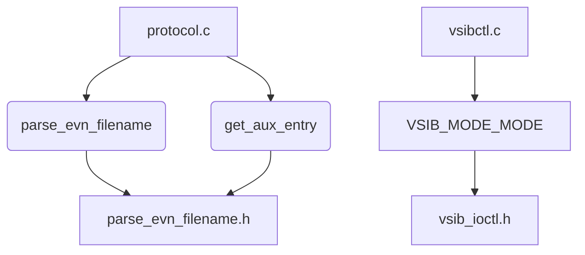

# Other — rtserver

# Module: rtserver

The `rtserver` module provides core functionality for handling real-time data transfers in the Tsunami system, particularly focusing on parsing EVN filenames and managing VSIbrute hardware control via ioctl commands.

## Purpose

This module supports:
- Parsing EVN-style filenames into structured metadata including start times and auxiliary info.
- Controlling VSIbrute character driver modes using ioctl interface.
- Supporting protocol-level operations such as opening real-time transfers.

## Key Components

### File Parsing (`parse_evn_filename.*`)
Parses EVN filename strings into a structured format that includes:
- Experiment name
- Station code
- Scan identifier
- Data start time (both ASCII and numeric representations)
- Auxiliary information array
- Validity flag

#### Functions
```c
struct evn_filename *parse_evn_filename(char *filename);
```
Takes an EVN filename string and returns a pointer to a parsed structure or NULL on failure.

```c
char *get_aux_entry(char *key, char **auxinfo, int nr_auxinfo);
```
Retrieves a value from the auxiliary info array by key.

### VSIbrute Hardware Control (`vsibctl.*`, `vsib_ioctl.h`)
Defines constants used with the Linux VSIbrute character driver's ioctl interface for setting board mode and retrieving status.

#### Constants
```c
#define VSIB_SET_MODE 0x7801
#define VSIB_MODE_STOP 0x0
#define VSIB_MODE_DIVISOR 0x0000ffff
#define VSIB_MODE_RUN 0x80000000
#define VSIB_MODE_GIGABIT 0x40000000
#define VSIB_MODE_EMBED_1PPS_MARKERS 0x20000000
```

These are used to configure the VSIbrute device behavior during capture sessions.

### Registration (`registration.h`)
Used internally to embed RCS identifiers in object files for version tracking purposes.

## Integration Points

### Protocol Layer
The functions `parse_evn_filename()` and `get_aux_entry()` are called from `ttp_open_transfer()` in `protocol.c`.

### Client Side
The function `start_vsib()` in `vsibctl.c` uses `VSIB_MODE_MODE` macro defined here to set up VSIbrute board configuration.

## Example Usage

To parse an EVN filename:

```c
#include "parse_evn_filename.h"

struct evn_filename *evn = parse_evn_filename("gre53_Ef_scan035_154d12h43m10s.vsi");

if (evn && evn->valid) {
    printf("Start Time: %lf\n", evn->data_start_time);
}
```

To control VSIbrute hardware mode:

```c
#include <sys/ioctl.h>
#include "vsib_ioctl.h"

int fd; // Assume valid file descriptor opened earlier
int mode = VSIB_MODE_MODE(2); // Set mode to 2
ioctl(fd, VSIB_SET_MODE, &mode);
```

## Build System

This module is built as part of the `rttsunamid` program using autotools. It depends on common library components.

### Makefile.am Snippet
```makefile
bin_PROGRAMS		= rttsunamid

rttsunamid_SOURCES	= \
			config.c \
			io.c \
			log.c \
			main.c \
			network.c \
			protocol.c \
			transcript.c \
			vsibctl.c \
			parse_evn_filename.c \
			parse_evn_filename.h
```

## Design Notes

- The parsing logic supports multiple EVN formats including those with fractional seconds.
- The VSIbrute ioctl constants define a multi-mode interface that allows flexible configuration depending on use case.
- All source files include appropriate headers and follow standard C conventions for portability.

## Mermaid Diagram

