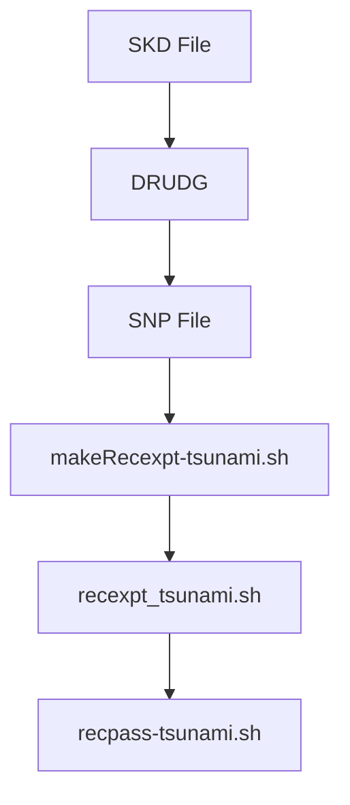

# Other — util

# Other — util

This module contains utility scripts and tools used in support of the Tsunami software package, primarily focused on experiment setup, recording, and testing. These are not part of the core library but provide automation and operational assistance for tasks such as generating schedule scripts, managing transfers, and analyzing performance.

## Purpose

The `util` directory provides shell scripts and configuration files that assist in:
- Generating client-side scripts (`recexpt_*.sh`) from SNAP files.
- Managing real-time Tsunami recordings via remote clients.
- Running network tests using iperf.
- Analyzing Tsunami transcripts with plotting utilities.
- Automating routine tasks like DRUDG processing or file transfer setups.

These tools are intended for use by operators or developers working with Tsunami-based experiments, especially those involving real-time data capture and playback.

## Key Components

### Scripts for Schedule Generation

#### `makeRecexpt.sh`
Generates a Bash script (`recexpt_*_*.sh`) based on a `.snp` file produced by DRUDG. This script is used to record all scans of an experiment locally onto disk using the `wr` tool.

It parses scan names and start times from the SNP file, converts them into date formats, and outputs a list of commands to execute `recpass`.

#### `makeRecexpt-tsunami.sh`
Similar to `makeRecexpt.sh`, but generates a version tailored for real-time Tsunami client-side recording. It creates a script that downloads each scan from a remote server using `recpass-tsunami`.

### Recording Tools

#### `recpass`
A simple script to initiate a single recording session using the `wr` program. It takes a scan name and duration in seconds, then sets up the correct parameters for writing to RAID.

#### `recpass-tsunami`
Designed for real-time Tsunami client usage. Downloads a single scan from a remote Tsunami server using the `tsunami` command-line client. Requires editing of server address, password, root directory, and rate settings before use.

### Experiment Execution Scripts

#### `recexpt.head` / `recexpt.tail`
Template files used by `makeRecexpt.sh` to generate full `recexpt_*_*.sh` scripts. They define common variables and control flow logic (e.g., skipping old scans).

#### `recexpt-tsunami.head` / `recexpt-tsunami.tail`
Same purpose as above, but for tsunami-specific scripts generated by `makeRecexpt-tsunami.sh`. Includes additional handling for background processes and time synchronization.

### Testing & Analysis

#### `iperf-tester.sh`
Runs a two-way UDP test using iperf between local machine and another host, testing various packet sizes and transmit rates at predefined bandwidths. Uses port 46224.

#### `tsuc2plot.sh`
Takes a Tsunami transcript file (`.tsuc`) and plots its performance metrics (transfer rates, loss) over time using Octave/GNUplot.

#### `tsunami-testload.sh`
Used to simulate or test real-time transfers via Tsunami. Continuously connects to a specified server and requests dummy transfer files.

### Automation Helpers

#### `MhDrudge.sh`
Automates processing of SKD files with DRUDG to produce PRC/SNP output files for station Mh. Also handles cleanup of existing output files and calls `makeRecexpt-tsunami.sh` to create corresponding recexpt scripts.

## Integration Points

These utilities are not directly integrated into core libraries but can be invoked manually or through automation tools like Makefiles or experiment control systems.

For example:
- The `Makefile.am` defines build targets (`readtest`, `writetest`, etc.) which may reference these tools.
- `MhDrudge.sh` is called during scheduling preparation to automate SNP/PRC creation.
- `makeRecexpt-tsunami.sh` generates client-side scripts needed for real-time data capture.

## Diagram: Schedule Script Generation Workflow

This diagram illustrates how an SKD schedule file is processed through DRUDG to generate a `.snp` file, then passed to the generator script to produce a final recording script that uses `recpass-tsunami`.

## Notes

Some scripts contain TODO comments indicating areas where improvements could be made, such as automatic samplerate detection in `makeRecexpt-tsunami.sh`. Others include hardcoded assumptions about RAID paths or frame rates that must be adjusted per system configuration.