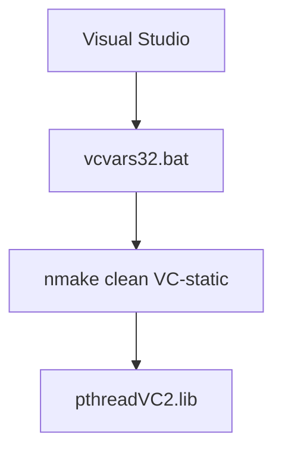

# Other — win32compat

# win32compat Module

This module provides compatibility layer support for POSIX thread functionality on Windows platforms. It specifically handles compilation of the static pthread library (`pthreadVC2.lib`) using Microsoft Visual C++ tools.

## Purpose

The primary purpose of this module is to facilitate building a Windows-compatible POSIX threading library that can be statically linked into applications. This enables cross-platform development where POSIX threads are used on Unix-like systems while maintaining equivalent functionality on Windows.

## Key Components

### pthreadVC2.lib Compilation Process

The module documents the process for compiling `pthreadVC2.lib` using Visual C++ 6.0 and newer versions. The compilation workflow involves:

1. Setting up the Visual C++ environment via `vcvars32.bat`
2. Executing `nmake clean VC-static` to build the static library

### Build Environment Requirements

- Visual Studio installation with `vcvars32.bat` available
- Command-line access through `cmd.exe`
- Support for multiple Visual C++ versions including:
  - Visual C++ 6.0 (VC6)
  - Visual C++ 7.1 (VC7.1)
  - Visual C++ 2005 (VC2005 Express)

### Default Installation Path

For Visual C++ 6.0, the `vcvars32.bat` file is typically located at:
```
C:\Program Files\Microsoft Visual Studio\VC98\Bin\
```

## Integration Points

This module serves as a build-time dependency rather than an active runtime component. It does not contain executable code but instead provides instructions for external tooling processes.

## Architecture Overview



## Usage Notes

This module acts as a reference guide for developers who need to rebuild or update the pthread library in their Windows development environments. Since no incoming or outgoing calls are documented, this module functions purely as informational content for the build system setup.

## Dependencies

No internal dependencies exist within this module. All operations rely entirely on external build tools and environment variables provided by Visual Studio installations.