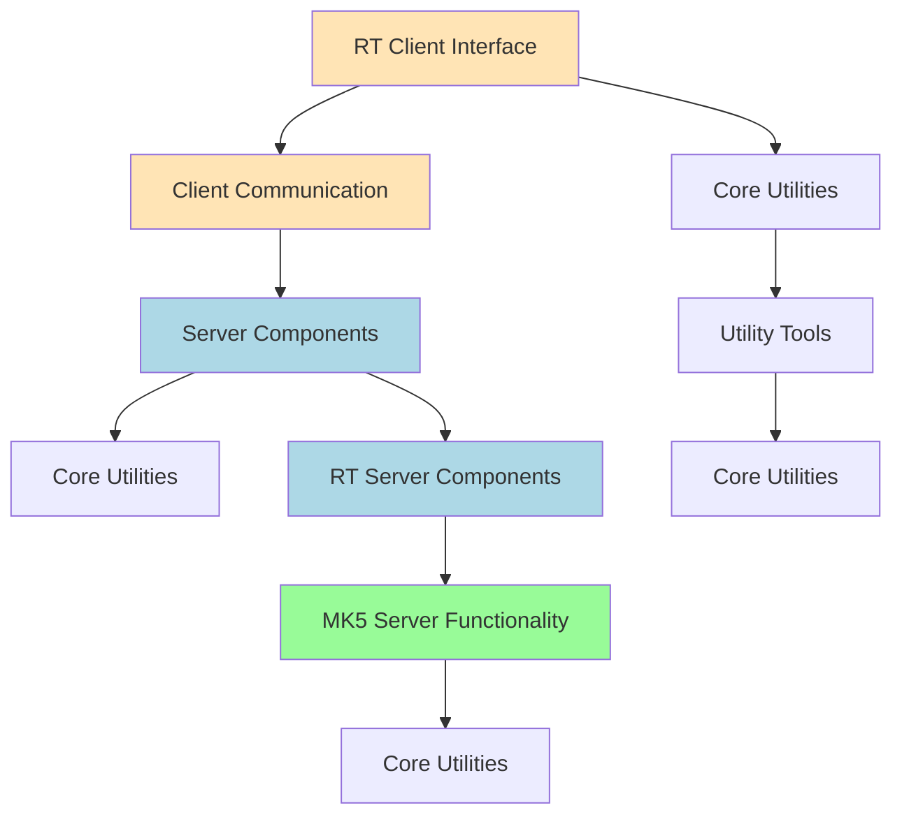

# tsunami-udp — Wiki

# Tsunami UDP Overview

Welcome to **tsunami-udp**, a real-time file transfer protocol implementation designed for high-performance data delivery with precise timing control.

This system enables clients to connect to servers over TCP and perform file transfers using UDP, supporting both standard and specialized real-time operations. It is particularly useful in environments such as Mark5 hardware or VSIB-based systems where accurate data streaming is required.

## Architecture

The following diagram shows the core modules involved in the Tsunami UDP system:



### Key Modules

- The [RT Client Interface](rt-client-interface.md) provides the command-line interface used by users.
- The [Client Communication](client-communication.md) module handles all client-side logic including connection management and protocol negotiation.
- The [Server Components](server-components.md) module implements core server functionality like configuration handling and authentication.
- The [RT Server Components](rt-server-components.md) provide real-time capabilities built on top of standard socket APIs.
- The [MK5 Server Functionality](mk5-server-functionality.md) supports integration with Mark5 hardware via StreamStor disk I/O.
- The [Core Utilities](core-utilities.md) module offers shared functions across the codebase, such as MD5 computation and time utilities.
- The [Utility Tools](utility-tools.md) module contains small diagnostic programs used for testing and benchmarking.

## End-to-End Flows

1. A user starts the RT client (`./client/tsunami`) and connects to a server using `connect`.
2. The client negotiates parameters with the server through the TCP session managed by the [Client Communication](client-communication.md) module.
3. Once connected, the client initiates file transfers using UDP, handled by the [RT Server Components](rt-server-components.md).
4. For real-time applications involving Mark5 hardware, the [MK5 Server Functionality](mk5-server-functionality.md) takes over to manage disk I/O via `xlrapi`.

## Setup Instructions

To compile and run tsunami-udp:

```bash
# Compile the project
./recompile.sh

# Start the server (example)
./server/tsunamid --help

# Run the client (example)
./client/tsunami help
```

For more detailed usage instructions, refer to the full command examples in the README excerpt:

```bash
# Full example command:
./client/tsunami connect your.server.add set udpport 51031 get path/to/yourfile quit
```

## Compatibility Notes

This system includes support for Windows compatibility through the [Windows Compatibility](windows-compatibility.md) module, which bridges POSIX threading semantics with Win32 APIs using the `pthreads-win32` library.

---

*Next: Explore the [Client Communication](client-communication.md) or [Server Components](server-components.md)*