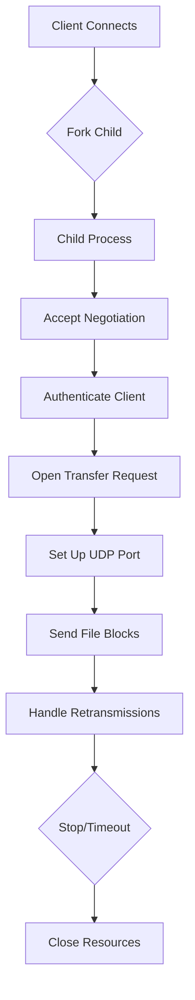

# Server Components

# Server Components

## Purpose

The Server Components module implements the core functionality of the Tsunami file transfer server. It handles incoming client connections, manages file transfers over UDP, negotiates protocol parameters, authenticates clients, and logs transfer statistics.

## Key Components

### Configuration Management (`config.c`)
Manages server configuration parameters with default values:
- `DEFAULT_BLOCK_SIZE`: Default block size (1024 bytes)
- `DEFAULT_SECRET`: Default shared secret ("kitten")
- `DEFAULT_TCP_PORT`: Default TCP port (TS_TCP_PORT)
- `DEFAULT_UDP_BUFFER`: Default UDP buffer size (20000000 bytes)
- `DEFAULT_HEARTBEAT_TIMEOUT`: Heartbeat timeout in seconds (15)

Functions:
- `reset_server()`: Initializes parameter structure with defaults

### Network Operations (`network.c`)
Handles socket creation and management:
- `create_tcp_socket()`: Creates IPv4 or IPv6 TCP listening socket
- `create_udp_socket()`: Creates UDP socket for data transmission

### Disk I/O (`io.c`)
Provides disk reading operations:
- `build_datagram()`: Reads file blocks and constructs datagrams

### Protocol Handling (`protocol.c`)
Implements TTP protocol negotiation and retransmission handling:
- `ttp_negotiate()`: Verifies protocol revision compatibility
- `ttp_authenticate()`: Handles client authentication using MD5 challenge-response
- `ttp_open_port()`: Sets up UDP communication channel
- `ttp_accept_retransmit()`: Processes retransmission requests from clients

### Logging & Transcripting (`log.c`, `transcript.c`)
- `log()`: Formats timestamped log messages
- `xscript_*()` functions: Generate detailed transfer transcripts

### Main Loop (`main.c`)
Coordinates server operation:
- `main()`: Entry point that listens for connections and forks child processes
- `client_handler()`: Child process logic for individual client sessions
- `reap()`: Signal handler for zombie process cleanup

## Execution Flow



## Integration Points

### External Dependencies
- `tsunami-server.h`: Core header defining structures and constants
- `include/tsunami.h`: Error handling utilities
- Common system libraries (`sys/socket.h`, `netinet/tcp.h`)

### Internal Calls
The module uses internal function calls to manage session state, including:
- `full_write()` and `full_read()` for reliable network I/O
- `getaddrinfo()` for address resolution
- `sendto()` for UDP packet delivery
- `fread()` and `fwrite()` for file I/O

## Command-Line Options

Supported options include:
- `--verbose`: Enable verbose output mode
- `--transcript`: Record statistics to transcript files
- `--v6`: Use IPv6 instead of IPv4
- `--port=n`: Set TCP port number
- `--secret=s`: Shared secret string
- `--buffer=bytes`: UDP socket send buffer size
- `--hbtimeout=seconds`: Heartbeat timeout value
- `--finishhook=cmd`: Execute command after transfer completion
- `--allhook=cmd`: Custom file listing program for GET *

## Authentication Protocol

The server implements a challenge-response authentication mechanism:
1. Server sends 64 bytes of random data to client
2. Client XORs shared secret with random data and computes MD5 hash
3. Client sends MD5 digest back to server
4. Server performs same computation and compares digests

## Data Transmission

File blocks are transmitted over UDP using the following format:
```
+---------------------+
|   block_number (4)  |
+----------+----------+
|   type (2) |   data (n) |
+----------+     :    :
:     :          :    :    :
+---------------------+
```

Each datagram consists of a 4-byte block number, 2-byte block type, followed by the actual data payload.

## Realtime Support

When compiled with `VSIB_REALTIME` flag:
- Supports real-time VLBI data streaming via `/dev/vsib`
- Parses EVN filename conventions for time-based start scheduling
- Implements IPD throttling for precise timing control