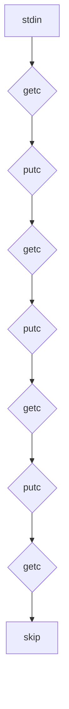
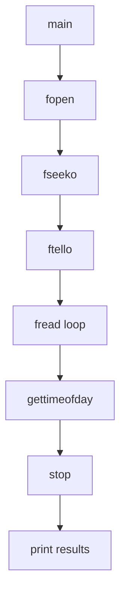

# Utility Tools

# Utility Tools

The **Utility Tools** module provides a collection of small command-line tools used for testing, benchmarking, and data manipulation in low-level system operations.

These utilities are typically compiled separately and executed directly from the terminal or shell scripts. They serve as lightweight diagnostics or performance measurement tools with minimal dependencies on other modules within the project.

## Purpose

This module contains standalone programs that perform specific tasks related to:

- Data skipping/filtering (`bskp`)
- Hexadecimal memory dumping (`dump`)
- Benchmarking disk read throughput (`readtest`)
- Benchmarking disk write throughput (`writetest`)
- Simulating fused reads with random delays (`fusereadtest`)
- Testing insertion sort logic (`insertsorttest`)

Each tool is designed to be simple, focused, and useful for debugging or validating hardware/software behavior under test conditions.

## Key Components

### `bskp.c`
A utility for reading input bytes and outputting every third byte from each group of four consecutive bytes.
- Reads from stdin
- Writes to stdout
- Skips one byte after every three bytes in a 4-byte sequence

#### Example Usage:
```bash
cat input.bin | ./bskp > output.bin
```

#### Execution Flow:


### `dump.c`
Dumps hexadecimal values of input bytes grouped into sets of three, formatted like standard hex dumps.
- Reads from stdin
- Outputs bytes in groups of three followed by spaces
- After every fourth group, starts a new line prefixed by address

#### Example Output:
```
0000: 00 01 02     03 04 05     06 07 08     09 0A 0B
```

### `readtest.c`
Measures disk read speed using buffered file I/O.

#### Features:
- Uses `malloc()` to allocate buffer
- Measures time between start and stop using `gettimeofday()`
- Calculates Mbps based on total bits read over elapsed microseconds

#### Execution Flow:


### `writetest.c`
Measures disk write speed using buffered file I/O.

#### Features:
- Allocates a block of memory via `malloc()`
- Writes fixed-size blocks repeatedly until reaching target size
- Reports performance metrics including Mbps

#### Execution Flow:
Same as `readtest`, but uses `fwrite` instead of `fread`.

### `fusereadtest.c`
Simulates fused read operations with randomized sleep intervals between reads.

#### Features:
- Randomly selects number of iterations per cycle (up to 4)
- Sleeps randomly between cycles using `usleep()`
- Tracks timing information through `gettimeofday()`
- Computes effective throughput during execution

#### Constants Used:
- `DIFX_RECEIVE_RING_LENGTH = 4`

#### Execution Flow:
```mermaid
graph TD
    A[main] --> B[srand]
    B --> C[fopen]
    C --> D[rand()]
    D --> E[fread]
    E --> F[usleep]
    F --> G[loop back to D]
    G --> H[close]
```

### `insertsorttest.c`
Tests insertion sorting logic for integer arrays. Demonstrates how elements are inserted while maintaining sorted order.

#### Functions:
- `insert(int val)` - inserts value into array at correct position
- `dumpTab()` - prints first few entries of the array

#### Use Case:
Used primarily for educational or internal validation purposes rather than production use.

## Integration Points

These tools do not depend on any shared libraries or core modules in this codebase. They rely only on standard C library functions (`stdio.h`, `stdlib.h`, etc.) and system calls such as:

- `gettimeofday()` – used by `readtest`, `writetest`, and `fusereadtest`
- `fopen/fread/fwrite/fclose` – basic file I/O routines
- `malloc/free` – dynamic allocation/deallocation
- `usleep` – delay function in `fusereadtest`

They may be invoked from shell scripts, automated test suites, or directly from command-line interfaces where raw data processing or benchmarking is required.

## Compilation Instructions

All utilities can be compiled using GCC with no special flags needed beyond `-o <output_name>`.

Example compilation commands:
```bash
gcc util/bskp.c -o bskp
gcc util/dump.c -o dump
gcc util/readtest.c -o readtest
gcc util/writetest.c -o writetest
gcc util/fusereadtest.c -o fusereadtest
gcc util/insertsorttest.c -o insertsorttest
```